# Arquitectura · Panadería (Gestión y caja)

> Informe generado a partir del código de la rama `modernizacion` (commit `fc4b34b`, septiembre 2026).
> Describe el estado actual del sistema: componentes, flujo de datos, dependencias y decisiones de diseño.

## Índice

1. [Visión general](#1-visión-general)
2. [Despliegue e infraestructura](#2-despliegue-e-infraestructura)
3. [Backend](#3-backend)
4. [Modelo de datos](#4-modelo-de-datos)
5. [Seguridad](#5-seguridad)
6. [Flujos de datos principales](#6-flujos-de-datos-principales)
7. [Frontend](#7-frontend)
8. [API HTTP](#8-api-http)
9. [Dependencias](#9-dependencias)
10. [Calidad y tests](#10-calidad-y-tests)
11. [Observaciones y riesgos](#11-observaciones-y-riesgos)

---

## 1. Visión general

Sistema ERP/POS para una panadería con cuatro perfiles de uso (Admin, Encargada, Vendedora,
Panadero). Cubre:

- **Caja (POS)**: turnos por usuario, ventas con descuento de stock y **arqueo ciego** al cierre.
- **Pedidos / comandas**: encargos con máquina de estados; al entregarse se cobran y generan una venta.
- **Producción**: lotes que suman stock de mostrador y descuentan insumos según **receta (escandallo)**.
- **Stock**: productos terminados (unidades) y materias primas (cantidades fraccionadas), mermas, alertas de mínimo.
- **Compras y gastos**: proveedores, compras de insumos con **costo promedio ponderado**, gastos varios.
- **Tablero financiero**: ventas por día y medio de pago, top de productos, merma valorizada, resultado.

Es una aplicación de tres capas clásica: SPA en React → API REST en FastAPI → PostgreSQL.

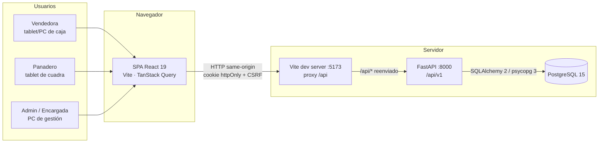

---

## 2. Despliegue e infraestructura

El entorno se orquesta con `docker-compose.yml`, con tres servicios:

| Servicio     | Imagen                                                     | Puerto                     | Rol                                                                      |
| ------------ | ---------------------------------------------------------- | -------------------------- | ------------------------------------------------------------------------ |
| `db`       | `postgres:15`                                            | `127.0.0.1:5433 → 5432` | Base de datos; volumen`postgres_data`; healthcheck `pg_isready`      |
| `web`      | `backend/Dockerfile` (Python 3.12-slim, usuario no root) | `127.0.0.1:8000`         | API. Al arrancar ejecuta`python -m app.db.migrate` y luego `uvicorn` |
| `frontend` | `frontend/Dockerfile` (Node 20-slim)                     | `5173`                   | Servidor Vite con proxy`/api → http://web:8000`                       |

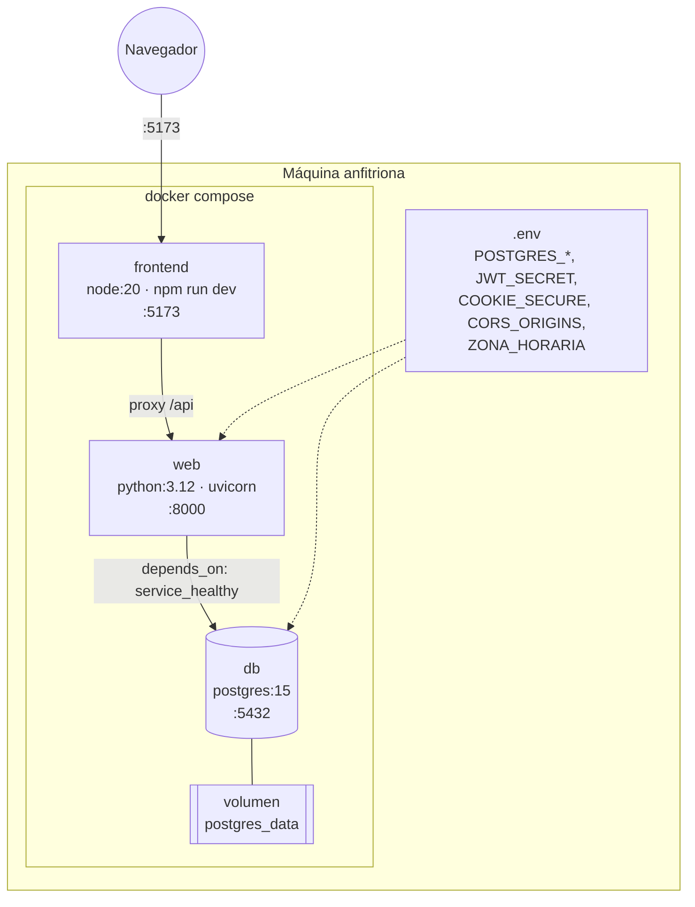

**Arranque del backend** (`app/db/migrate.py`):

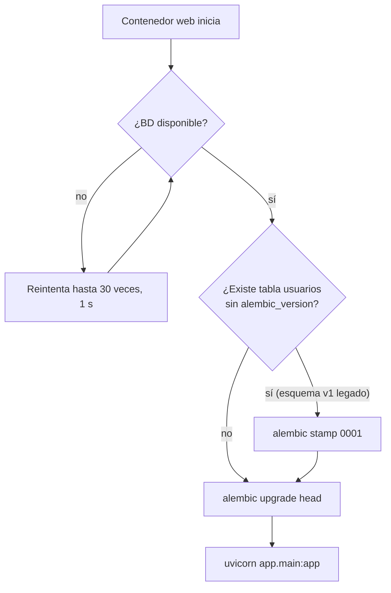

Esto permite migrar una base creada con la versión anterior (sin Alembic) conservando los datos.
Las migraciones viven en `backend/alembic/versions/` (`0001_esquema_legacy`, `0002_modernizacion`).

**Configuración** (`app/core/config.py`): `pydantic-settings` lee variables de entorno o `.env`.
Los secretos no tienen valor por defecto (`JWT_SECRET` exige ≥ 32 caracteres), así que la app no
arranca mal configurada. `DATABASE_URL` con `postgresql://` se normaliza a `postgresql+psycopg://`.

---

## 3. Backend

### 3.1 Organización por capas

```
backend/app/
  main.py      create_app(): middlewares, handlers de error, montaje de routers
  cli.py       python -m app.cli crear-admin <usuario>
  core/        config, security (bcrypt/JWT/CSRF), errors, rate_limit
  db/          base (tipos Dinero/Cantidad), session (engine + get_db), migrate
  models/      tablas SQLAlchemy 2 (Mapped[...])
  schemas/     modelos Pydantic de entrada/salida
  services/    reglas de negocio y transacciones
  api/deps.py  dependencias: sesión BD, usuario actual, CSRF, roles
  api/v1/      routers HTTP delgados
```

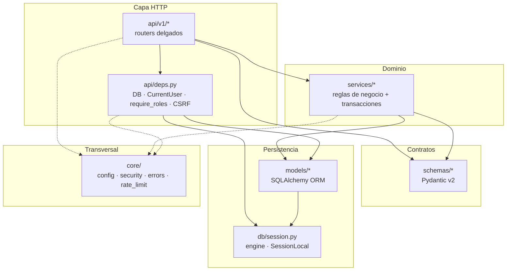

**Responsabilidades**

- **Routers** (`api/v1`): validan entrada con schemas, aplican autenticación/rol vía `Depends`, llaman
  al servicio y dan forma a la salida (`_venta_out`, `_pedido_out`, etc.). No contienen reglas de negocio.
- **Servicios** (`services`): toda la lógica; cada operación de escritura es **una transacción** que
  hace `commit` al final (o `flush` si la invoca otro servicio, p. ej. `crear_venta(commit=False)` desde
  `pedidos.entregar`).
- **Errores de dominio** (`core/errors.py`): `NotFoundError`, `ConflictError`, `AuthError`,
  `ForbiddenError`, `TooManyRequestsError`. Un handler global los transforma al formato único
  `{"error": {"code", "message", "details"}}`; las excepciones no controladas devuelven 500 sin filtrar detalles.

### 3.2 Módulos de servicio y sus dependencias

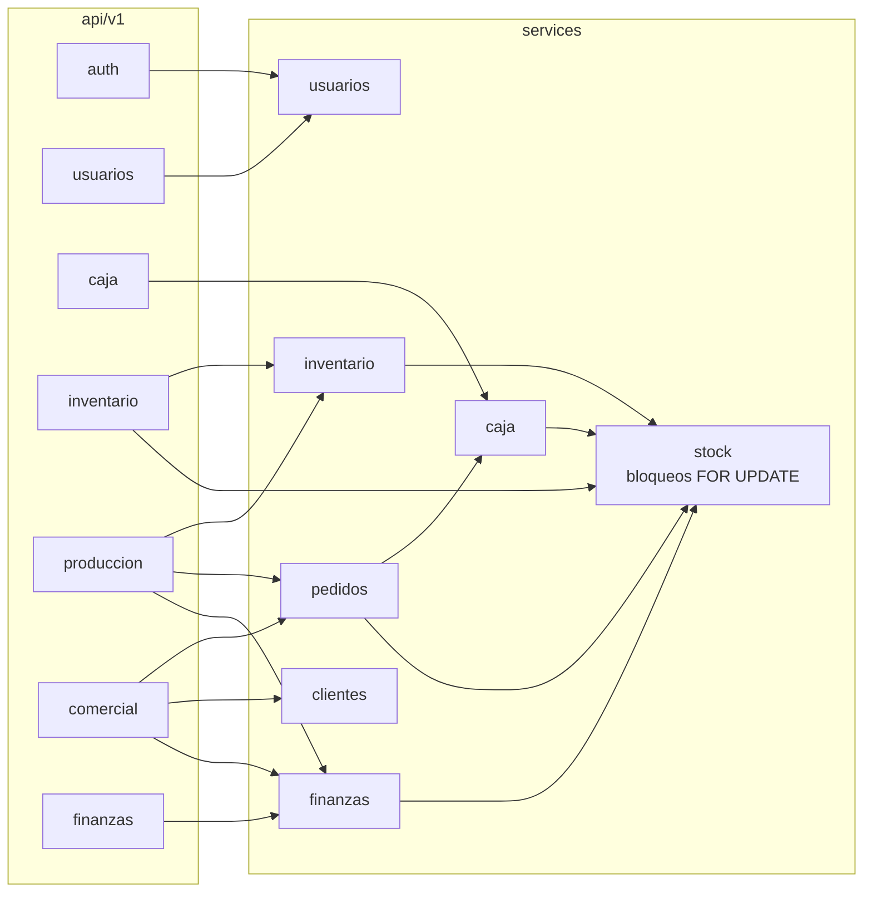

`services/stock.py` es el núcleo de concurrencia: todas las operaciones que modifican stock pasan por
`bloquear_productos` / `bloquear_materias_primas` (`SELECT … FOR UPDATE` ordenado por id, para evitar
deadlocks) y `descontar_productos` (valida todo antes de descontar: todo o nada).

`services/finanzas.py` además aporta utilidades de fecha (`hoy()`, `rango_local()`) basadas en
`ZONA_HORARIA`, reutilizadas por los routers de pedidos y producción para interpretar filtros por día.

### 3.3 Pipeline de una petición

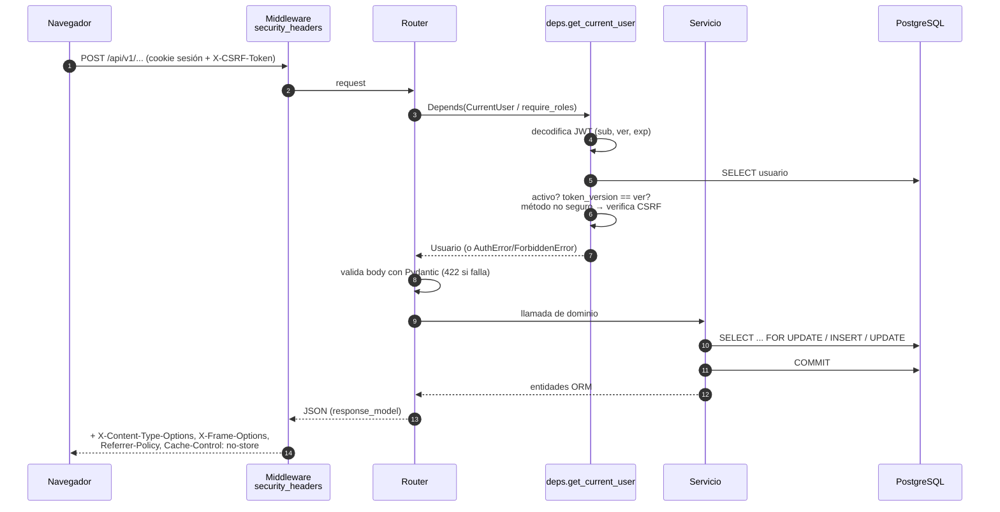

---

## 4. Modelo de datos

Convenciones (`app/db/base.py`):

- `Dinero = Numeric(12, 2)` — el dinero nunca es `float`.
- `Cantidad = Numeric(12, 3)` — insumos en kg/l/unidades fraccionadas.
- `CostoUnitario = Numeric(14, 4)` — costos y cantidades de receta.
- `FechaHora = DateTime(timezone=True)`; todas las fechas se guardan en UTC (`utcnow()`).
- Los enums se guardan por **nombre** (`ADMIN`, `ABIERTO`…) y la API expone el **valor** (`Admin`, `Abierto`…).

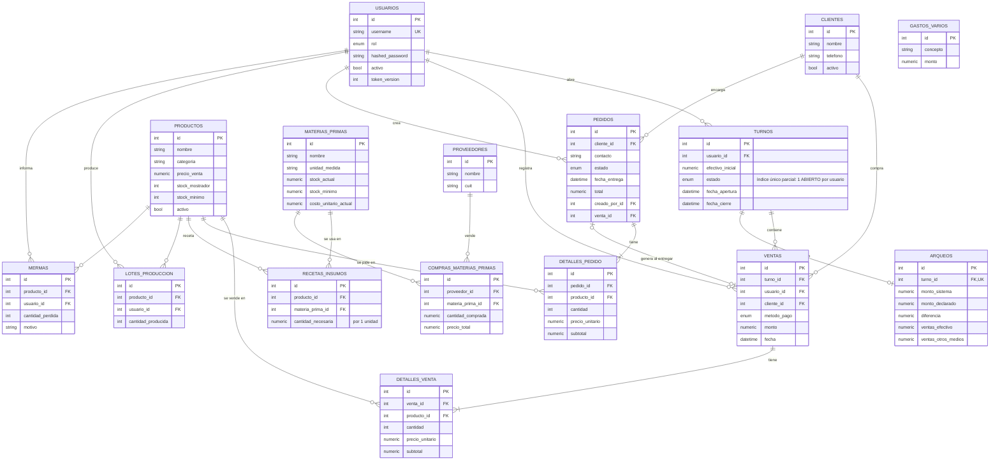

**Invariantes garantizadas por la base**

- Un usuario no puede tener dos turnos `ABIERTO` (índice único parcial `uq_turno_abierto_por_usuario`).
- Un turno tiene como máximo un arqueo (`arqueos.turno_id` único).
- Una materia prima aparece una sola vez por receta (`UniqueConstraint(producto_id, materia_prima_id)`).

---

## 5. Seguridad

### 5.1 Autenticación y sesión

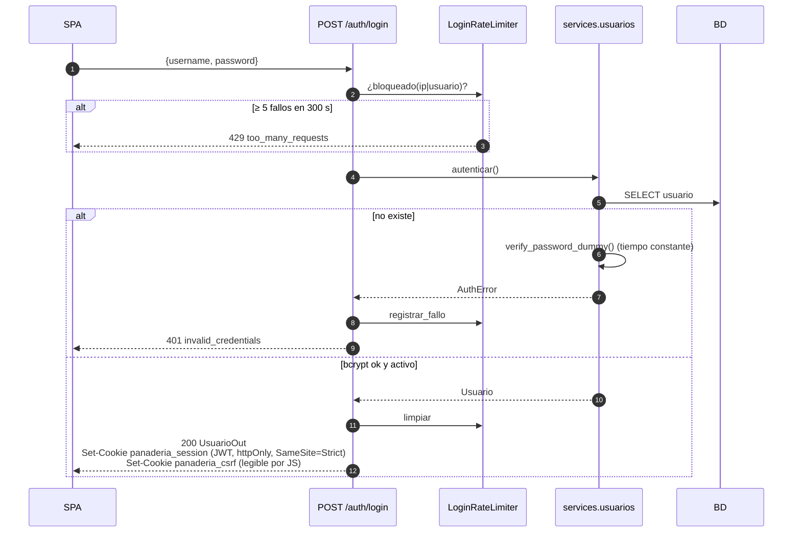

- **JWT** (HS256 por defecto) con claims `sub`, `ver`, `iat`, `exp`. Duración configurable (5 min a 24 h; por defecto 8 h).
- **Revocación**: `usuarios.token_version` se incrementa al cambiar la contraseña, desactivar al usuario,
  cambiarle el rol o usar "cerrar todas las sesiones". Un token con `ver` distinto se rechaza.
- **CSRF double-submit**: en métodos no seguros con cookie, el header `X-CSRF-Token` debe coincidir con
  la cookie `panaderia_csrf` (`secrets.compare_digest`). Con `Authorization: Bearer` (Swagger/clientes API) no aplica.
- **Rate limit** de login en memoria por proceso (IP + usuario).
- **Cabeceras** de seguridad en todas las respuestas y `Cache-Control: no-store` en `/api/v1`.
- Swagger/OpenAPI deshabilitados con `ENV=production`.
- El contenedor de la API corre con usuario no root; Postgres y la API solo escuchan en `127.0.0.1`.

### 5.2 Autorización por rol

Definida en el backend (`api/deps.py`); el frontend (`lib/roles.js`) solo la refleja para ordenar la UI.

| Grupo           | Roles                       | Uso                                                                                          |
| --------------- | --------------------------- | -------------------------------------------------------------------------------------------- |
| `Admin`       | Admin                       | Gestión de usuarios                                                                         |
| `Gestion`     | Admin, Encargada            | Productos, recetas, materias primas, compras, gastos, proveedores, arqueos, tablero, alertas |
| `Mostrador`   | Admin, Encargada, Vendedora | Turnos, ventas, crear/editar/entregar pedidos, clientes                                      |
| `Produccion`  | Admin, Encargada, Panadero  | Registrar producción, pendiente por pedidos                                                 |
| `CurrentUser` | Todos                       | Ver productos/insumos/recetas, listar pedidos, cambiar estado de pedidos, mermas             |

Reglas adicionales dentro de servicios: el Panadero no puede **cancelar** pedidos; debe quedar al menos
un Admin activo; nadie puede desactivarse a sí mismo; solo Gestión puede ver productos inactivos.

---

## 6. Flujos de datos principales

### 6.1 Venta en caja (POS)

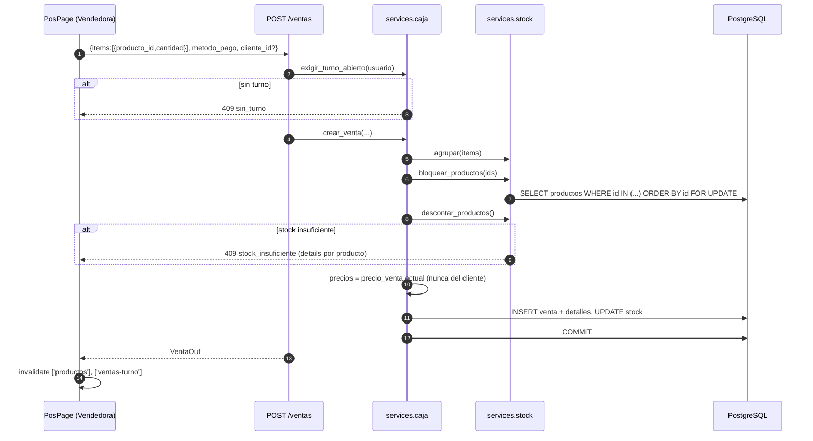

### 6.2 Turno y arqueo ciego

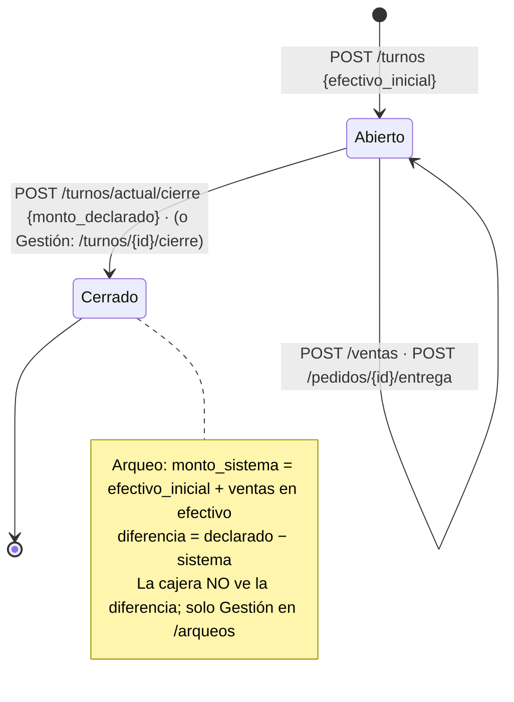

El cierre bloquea la fila del turno (`FOR UPDATE`) para evitar cierres dobles.

### 6.3 Ciclo de vida de un pedido

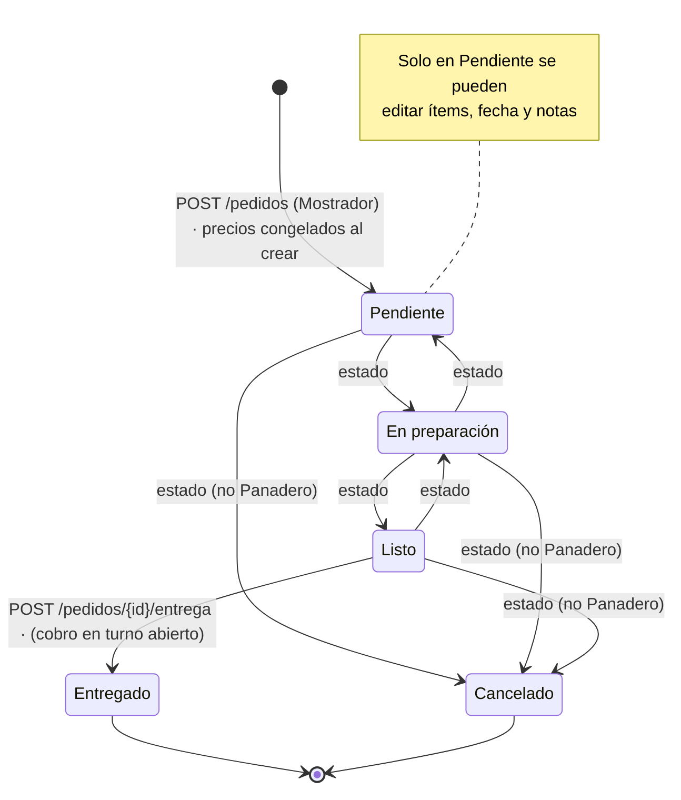

La entrega (`pedidos.entregar`) ocurre en **una sola transacción**: bloquea el pedido, llama a
`caja.crear_venta(commit=False)` con los precios pactados en el pedido, descuenta stock del mostrador,
enlaza `pedido.venta_id` y hace commit.

### 6.4 Producción, compras y costo

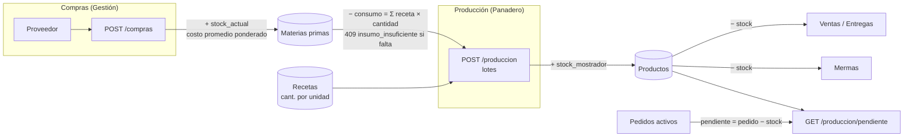

- **Costo promedio ponderado** (`finanzas.registrar_compra`):
  `nuevo_costo = (stock_previo × costo_anterior + precio_total) / (stock_previo + cantidad)`.
- **Costo de receta** (`GET /productos/{id}/receta`): `Σ cantidad_necesaria × costo_unitario_actual`.
- La producción valida **todos** los insumos antes de tocar nada: o se registran todos los lotes o ninguno.

### 6.5 Tablero financiero

`GET /finanzas/resumen?desde&hasta` (máx. 1 año, por defecto últimos 30 días) agrega en la zona horaria
local: ventas totales, cantidad y ticket promedio; ventas por medio de pago y por día; top 10 de
productos; compras de insumos; gastos; merma (unidades y valorizada a precio de venta); y
`resultado = ventas − compras − gastos`.

---

## 7. Frontend

### 7.1 Estructura

```
frontend/src/
  main.jsx          QueryClient · BrowserRouter · ToastProvider · AuthProvider
  App.jsx           rutas con lazy loading y guardas por rol
  auth/             AuthProvider (sesión vía /auth/me), RequireAuth, contexto
  lib/
    api.js          axios: baseURL /api/v1, CSRF automático, evento auth:expired en 401
    queries.js      claves de caché (qk) y hooks useQuery por recurso
    roles.js        constantes de rol, navegación, inicio por rol
    format.js       formato es-AR (moneda ARS, fechas)
    stock.js        semáforo de stock
    theme.js        claro / oscuro / sistema
  components/
    layout/AppShell navegación lateral / cajón móvil, selector de tema, logout
    ui/             Button, Field, Modal, Spinner, Toast, misc
  features/         una carpeta por pantalla
    pos/ pedidos/ produccion/ stock/ clientes/ admin/ LoginPage
```

### 7.2 Árbol de componentes y rutas

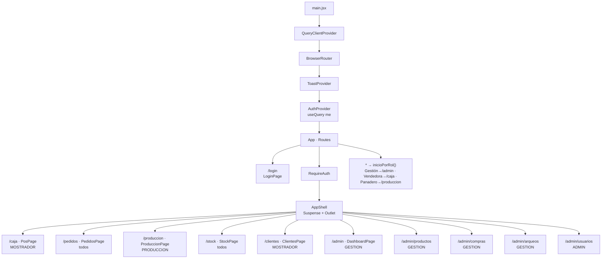

Cada pantalla se carga con `React.lazy`: la caja no descarga el código del tablero.

### 7.3 Estado y sincronización

No hay store global; el **estado del servidor vive en la caché de TanStack Query**:

- Claves centralizadas en `lib/queries.js` (`qk`). Invalidar `['productos']` refresca todas sus variantes.
- `staleTime` 15 s, `refetchOnWindowFocus`, reintentos solo ante errores de red o 5xx.
- **Refresco periódico** (polling) para ver lo que hacen otros puestos:
  productos y materias primas cada **8 s**; pedidos y pendiente de producción cada **15 s**.
- Tras cada mutación se invalidan las claves afectadas (p. ej. una venta invalida `productos` y `ventas-turno`;
  una entrega invalida además `pedidos`).

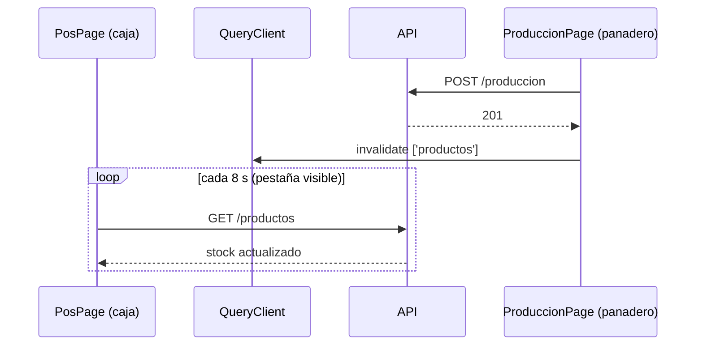

**Sesión en el cliente**: `AuthProvider` consulta `/auth/me` al iniciar (401 ⇒ `user = null`). Ante
cualquier 401 posterior, el interceptor de axios emite `auth:expired`, que limpia la sesión y la caché
de datos (conservando la query `me`) y `RequireAuth` redirige a `/login`.

---

## 8. API HTTP

Prefijo `/api/v1`. Documentación interactiva en `/api/docs` (salvo producción). Salud: `GET /api/health`.

| Módulo               | Endpoints                                                                                                                                                              | Acceso             |
| --------------------- | ---------------------------------------------------------------------------------------------------------------------------------------------------------------------- | ------------------ |
| **auth**        | `POST /auth/login`, `POST /auth/token` (OAuth2, Swagger), `POST /auth/logout`, `GET /auth/me`, `POST /auth/cambiar-password`, `POST /auth/cerrar-sesiones` | público / sesión |
| **usuarios**    | `GET/POST /usuarios`, `PATCH /usuarios/{id}`                                                                                                                       | Admin              |
| **caja**        | `GET /turnos/actual`, `POST /turnos`, `POST /turnos/actual/cierre`, `GET /turnos/actual/ventas`, `POST /ventas`                                              | Mostrador          |
|                       | `GET /turnos/abiertos`, `POST /turnos/{id}/cierre`, `GET /arqueos`                                                                                               | Gestión           |
| **inventario**  | `GET /productos`, `GET /productos/{id}/receta`, `GET /materias-primas`                                                                                           | todos              |
|                       | `POST/PATCH /productos`, `PUT /productos/{id}/stock`, `PUT /productos/{id}/receta`, `POST/PATCH /materias-primas`                                              | Gestión           |
| **producción** | `POST /produccion`, `GET /produccion/pendiente`                                                                                                                    | Producción        |
|                       | `POST /mermas`                                                                                                                                                       | todos              |
| **comercial**   | `GET /pedidos`, `GET /pedidos/{id}`, `POST /pedidos/{id}/estado`                                                                                                 | todos              |
|                       | `POST /pedidos`, `PATCH /pedidos/{id}`, `POST /pedidos/{id}/entrega`, `GET/POST/PATCH /clientes`                                                               | Mostrador          |
| **finanzas**    | `GET/POST/PUT /proveedores`, `GET/POST /compras`, `GET/POST /gastos`, `GET /finanzas/resumen`, `GET /stock/alertas`                                          | Gestión           |

**Formato de error** único:

```json
{ "error": { "code": "stock_insuficiente", "message": "Stock insuficiente: ...", "details": [ ... ] } }
```

Códigos de dominio relevantes: `sin_turno`, `turno_ya_abierto`, `turno_cerrado`, `stock_insuficiente`,
`insumo_insuficiente`, `transicion_invalida`, `username_taken`, `invalid_credentials`, `csrf_failed`,
`validation_error` (422, con `details: [{campo, mensaje}]`).

Los `Decimal` se serializan como número JSON en las salidas (`DineroOut`) y se validan con precisión en
las entradas (`DineroPositivo`, `CantidadInsumo`, `Unidades` ≤ 100 000).

---

## 9. Dependencias

### 9.1 Backend (`backend/requirements.txt`, Python 3.12)

| Paquete                      | Versión        | Uso                                 |
| ---------------------------- | --------------- | ----------------------------------- |
| fastapi                      | 0.141.1         | Framework HTTP, DI, OpenAPI         |
| uvicorn[standard]            | 0.53.0          | Servidor ASGI                       |
| SQLAlchemy                   | 2.0.54          | ORM (estilo 2.0,`Mapped`)         |
| psycopg[binary]              | 3.3.6           | Driver PostgreSQL                   |
| alembic                      | 1.20.0          | Migraciones                         |
| pydantic / pydantic-settings | 2.13.5 / 2.15.0 | Validación y configuración        |
| PyJWT                        | 2.15.0          | Tokens de sesión                   |
| bcrypt                       | 5.0.0           | Hash de contraseñas                |
| python-multipart             | 0.0.32          | Formulario OAuth2 (`/auth/token`) |
| email-validator              | 2.3.0           | Validación de emails               |
| tzdata                       | 2026.4          | Zonas horarias (`zoneinfo`)       |

Desarrollo (`requirements-dev.txt`): `pytest`, `httpx`, `ruff`.

### 9.2 Frontend (`frontend/package.json`, Node 20)

| Paquete                                         | Uso                                              |
| ----------------------------------------------- | ------------------------------------------------ |
| react / react-dom 19                            | UI                                               |
| react-router-dom 7                              | Enrutamiento                                     |
| @tanstack/react-query 5                         | Caché y sincronización del estado del servidor |
| axios 1                                         | Cliente HTTP con interceptores (CSRF, 401)       |
| lucide-react                                    | Iconos                                           |
| vite 8 + @vitejs/plugin-react                   | Dev server, proxy, build                         |
| tailwindcss 3 + postcss + autoprefixer          | Estilos (modo oscuro por clase)                  |
| eslint 10 + plugins react-hooks / react-refresh | Lint                                             |

### 9.3 Grafo de dependencias entre componentes

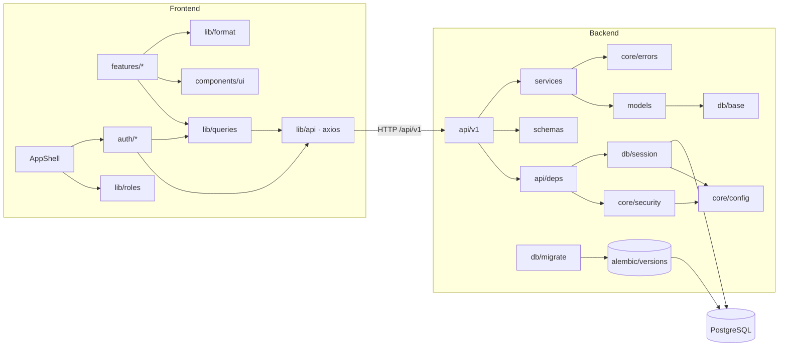

---

## 10. Calidad y tests

- **Tests** (`backend/tests`, 43 casos): autenticación, caja, inventario, pedidos, permisos por rol y
  concurrencia. Por defecto corren sobre **SQLite temporal**; con `TEST_DATABASE_URL` corren sobre
  PostgreSQL, lo que habilita `test_ventas_concurrentes_no_sobrevenden` (verifica los bloqueos `FOR UPDATE`).
- **Lint**: `ruff` con reglas `E, F, I, B, UP, S` (incluye chequeos de seguridad de bandit);
  `eslint` en el frontend.
- **Coherencia de esquema**: `alembic check` verifica que los modelos coincidan con las migraciones.
- **Datos de demo**: `python -m scripts.seed_demo` (solo sobre base vacía).

---

## 11. Observaciones y riesgos

Puntos a tener en cuenta para evolucionar el sistema:

1. **Frontend solo en modo desarrollo.** El `Dockerfile` del frontend corre `npm run dev` y el proxy
   `/api` lo resuelve Vite. Para producción conviene un build estático (`vite build`) servido por un
   reverse proxy (nginx/Caddy) que también reenvíe `/api` y termine TLS (`COOKIE_SECURE=true`).
2. **Puerto 5173 expuesto en todas las interfaces** (a diferencia de la API y la BD, ligadas a
   `127.0.0.1`). Probablemente intencional para que tablets de la red local accedan, pero merece confirmarse.
3. **API con `--reload` y código montado como volumen** en `docker-compose.yml`: adecuado para desarrollo,
   no para producción (el `CMD` del Dockerfile ya lo omite).
4. **Rate limiter en memoria por proceso**: válido con un único worker de uvicorn; con varias réplicas
   haría falta un almacén compartido (Redis).
5. **Sincronización por polling** (8–15 s). Suficiente para el volumen de una panadería; si crece la
   cantidad de puestos, SSE/WebSockets reducirían carga y latencia.
6. **Métricas financieras en base caja**: `resultado = ventas − compras − gastos` no usa el costo de lo
   vendido (aunque el sistema ya tiene recetas y costo promedio para calcularlo). La merma se valoriza a
   **precio de venta**, no a costo.
7. **Diferencias SQLite/PostgreSQL en tests**: `FOR UPDATE` e índices parciales se comportan distinto;
   conviene correr la suite contra PostgreSQL en CI.
8. **Límites fijos en listados** (`limit 200/500`) en lugar de paginación; a largo plazo, pedidos y
   ventas históricas necesitarán paginar.
