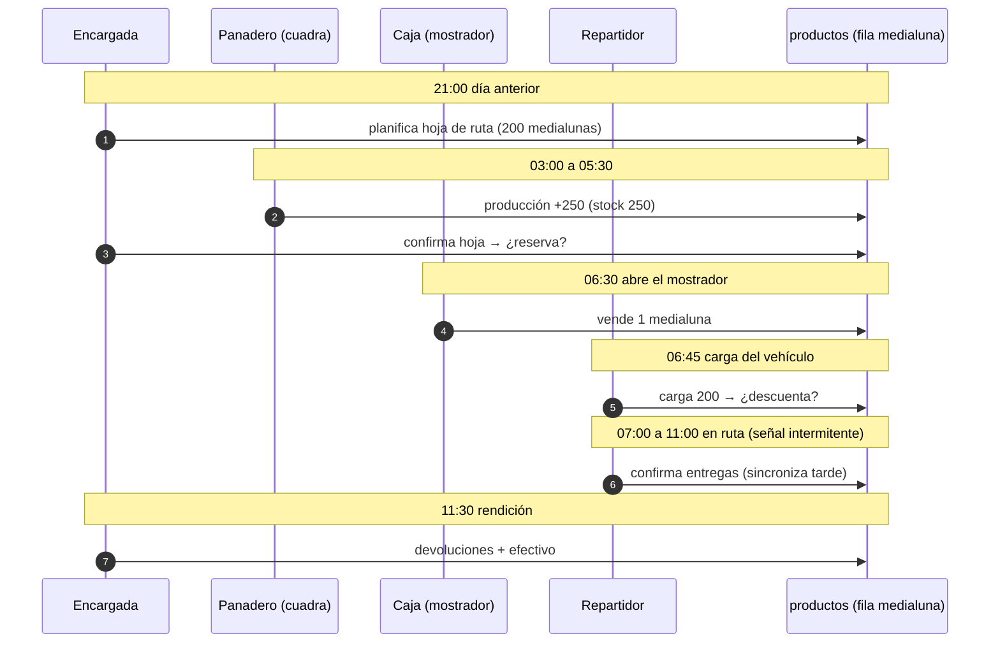
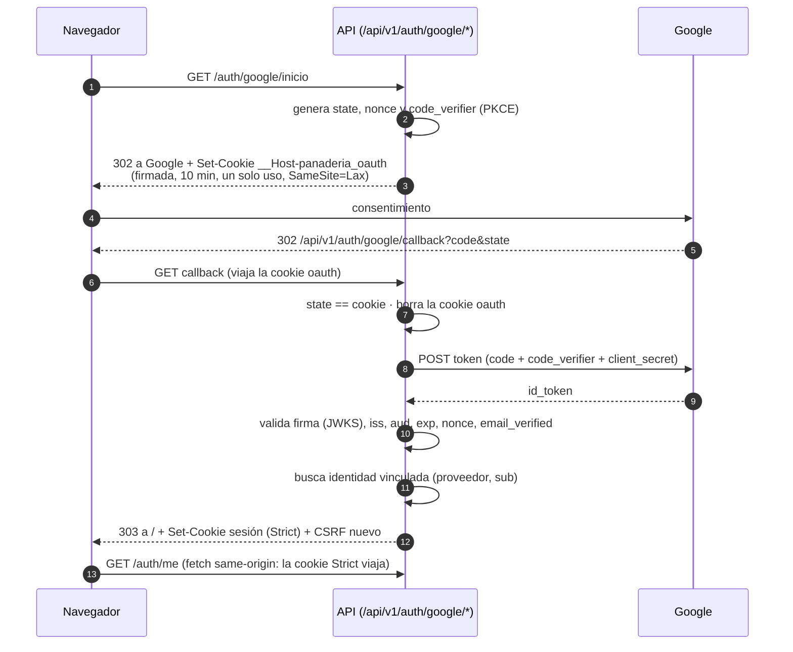
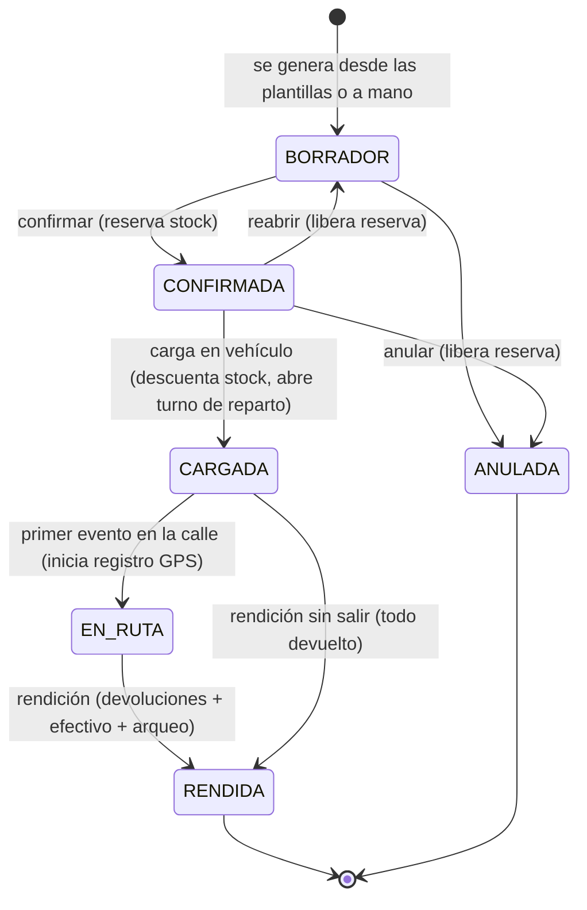
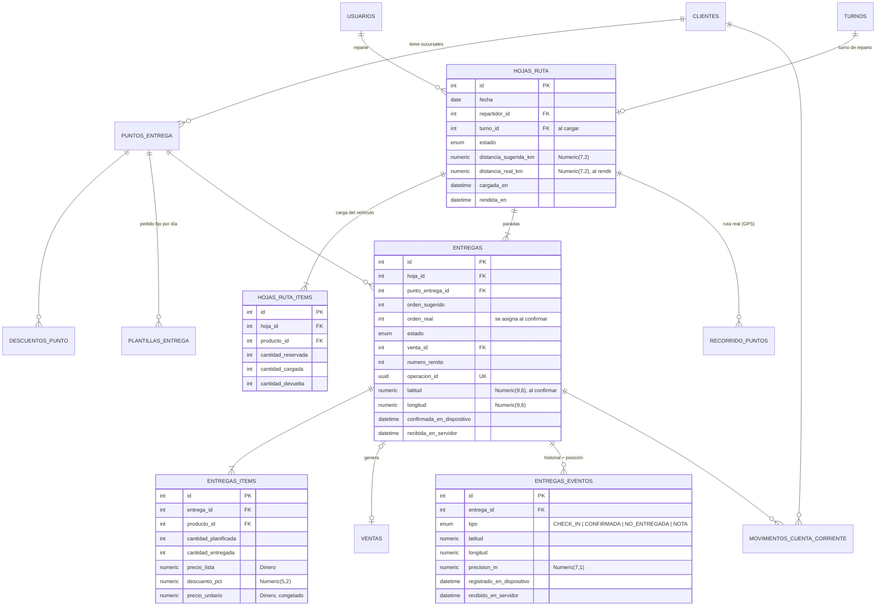
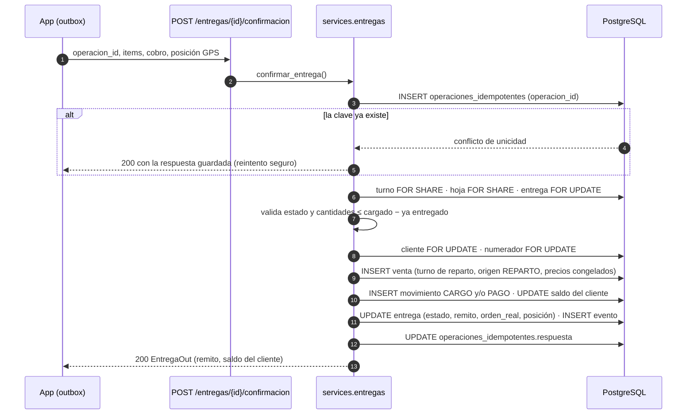
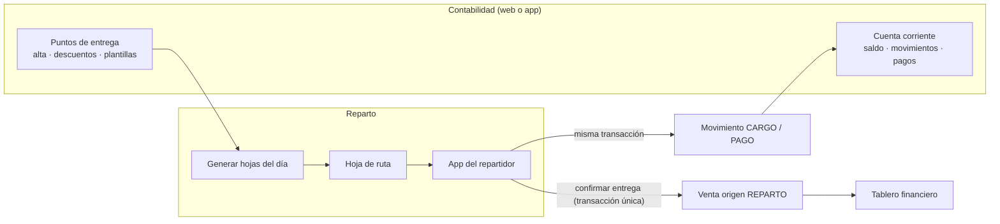
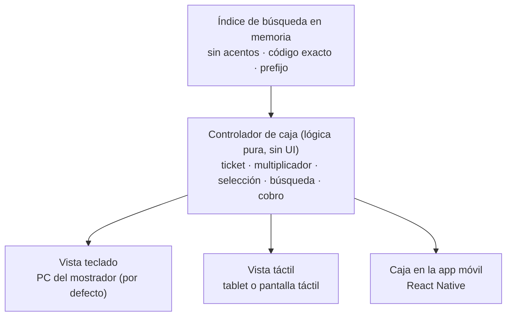
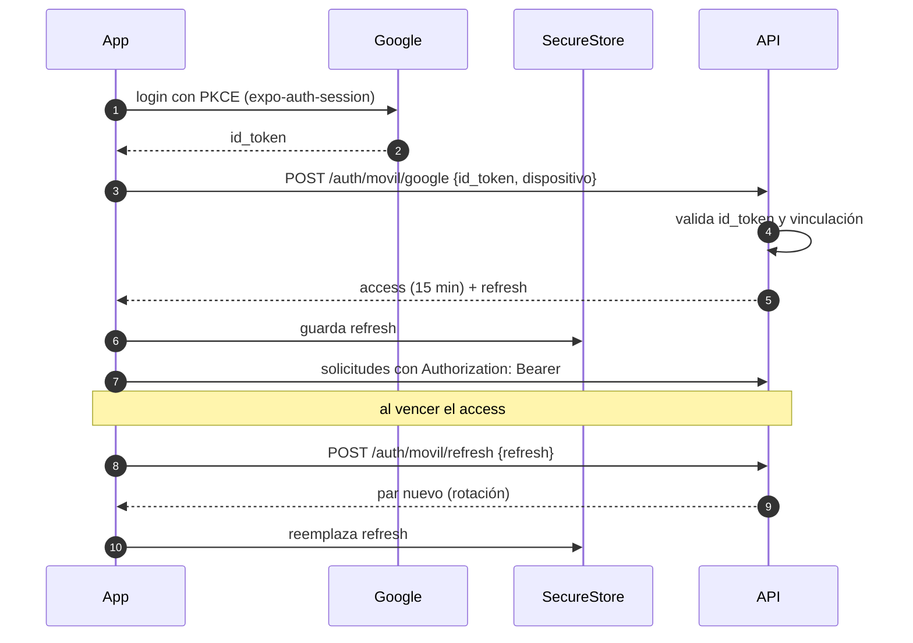

# RFC-001 · Reparto matutino, despliegue en producción y aplicación móvil

| | |
|---|---|
| **Estado** | Borrador v2 para revisión |
| **Fecha** | 2026-09-30 |
| **Base** | Rama `modernizacion` (commit `fc4b34b`) · ver [`arquitectura.md`](arquitectura.md) |
| **Alcance** | Backend FastAPI, infraestructura, cliente web (caja y contabilidad) y app móvil universal |

### Historial de cambios

| Versión | Cambios |
|---|---|
| v1 | Reparto matutino, despliegue con Cloudflare y app móvil para repartidor y monitoreo |
| v2 | **Autenticación híbrida** (Google + PIN de caja) · **caja orientada a teclado** · **puntos de entrega** con descuentos por local en el módulo contable · **cuenta corriente simple, sin límite de crédito** · **app móvil universal** · **infraestructura low-cost** (VPS chico o Proxmox) · **ruta sugerida no obligatoria y registro del recorrido real** |

## Índice

0. [Resumen y decisiones clave](#0-resumen-y-decisiones-clave)
1. [Análisis previo: concurrencia entre reparto y caja](#1-análisis-previo-concurrencia-entre-reparto-y-caja)
2. [Autenticación híbrida](#2-autenticación-híbrida)
3. [Módulo de reparto matutino](#3-módulo-de-reparto-matutino)
4. [Puntos de entrega y cuenta corriente (módulo contable)](#4-puntos-de-entrega-y-cuenta-corriente-módulo-contable)
5. [Ruta sugerida y registro del recorrido real](#5-ruta-sugerida-y-registro-del-recorrido-real)
6. [Caja orientada a teclado](#6-caja-orientada-a-teclado)
7. [Infraestructura de producción low-cost](#7-infraestructura-de-producción-low-cost)
8. [Aplicación móvil universal](#8-aplicación-móvil-universal)
9. [Impacto consolidado en `app/models/` y migraciones](#9-impacto-consolidado-en-appmodels-y-migraciones)
10. [Dependencias nuevas](#10-dependencias-nuevas)
11. [Plan de ejecución por fases](#11-plan-de-ejecución-por-fases)
12. [Riesgos y preguntas abiertas](#12-riesgos-y-preguntas-abiertas)

---

## 0. Resumen y decisiones clave

El sistema se extiende **sin reescribir nada**: se agregan modelos, servicios y routers
nuevos, y se hacen cambios acotados en los módulos existentes. Se mantienen la separación
Router → Service → Model, los tipos `Dinero`/`Cantidad`/`CostoUnitario` y el formato de error
`{"error": {"code", "message", "details"}}`. Ningún cálculo de dinero usa `float`.

| # | Decisión | Alternativa descartada | Motivo principal |
|---|---|---|---|
| D1 | **Reservar** stock al confirmar la hoja de ruta y **descontarlo al cargar** el vehículo | Descontar al armar la hoja · descontar al confirmar la entrega | Es la única opción en que la caja nunca vende mercadería comprometida o que ya salió del local (§1) |
| D2 | La reserva es un contador `productos.stock_reservado` protegido por el **mismo bloqueo de fila** que ya usa la caja | Tabla de reservas + `SUM()` en cada venta | Reutiliza `bloquear_productos` sin agregar locks ni consultas a la venta de mostrador |
| D3 | **Jerarquía global de bloqueos** (idempotencia → turno → hoja → entregas → cliente → numerador → productos → insumos) | Bloqueos ad hoc por servicio | Previene deadlocks por construcción (§3.4) |
| D4 | Cada entrega cobrada es una **`Venta`** dentro de un **turno de reparto** y se rinde con arqueo | Tabla de cobros paralela | Reutiliza arqueo, tablero financiero y reportes existentes |
| D5 | **Cuenta corriente simple**: cargos, pagos, notas de crédito y ajustes, **sin límite de crédito** | Consignación · límite de crédito bloqueante | Así trabaja hoy la panadería. El pan se vence en el día: la devolución es nota de crédito (§4) |
| D6 | **Cloudflare Tunnel** + **Caddy** sirviendo el build estático y `/api` en el **mismo origen** | Nginx/Caddy expuesto con Origin CA | No requiere IP pública ni abrir puertos, y la IP del origen queda oculta |
| D7 | Cookies con prefijo **`__Host-`** y `COOKIE_DOMAIN` vacío | Cookie con `Domain=.dominio.com` | Bloquea *cookie tossing* desde subdominios, el punto débil del CSRF por doble envío |
| D8 | App **Expo (React Native)** | PWA | Almacenamiento seguro (Keychain/Keystore), offline confiable en iOS, GPS e impresión Bluetooth |
| D9 | Móvil con **Bearer (15 min) + refresh token opaco rotativo**, con detección de reutilización y **ventana de gracia** | JWT de larga duración | Revocable por dispositivo y tolerante a respuestas perdidas con señal intermitente |
| D10 | Offline con **cola de salida (outbox)** + `operacion_id` UUID idempotente | Sincronización bidireccional con resolución de conflictos | El servidor sigue siendo la autoridad y los reintentos son seguros |
| D11 | **Google (OpenID Connect)** con flujo *authorization code + PKCE* resuelto en el servidor; solo entran cuentas **vinculadas previamente** por un admin | Alta automática de cualquier cuenta de Google | Nadie obtiene acceso solo por tener Gmail; el rol lo sigue decidiendo el sistema (§2) |
| D12 | **PIN solo en equipos de caja registrados**, con sesión de alcance limitado (`amr=pin`) y **reautenticación** para gestión | PIN válido desde cualquier equipo | Un PIN de 4–6 dígitos es cómodo pero débil; el equipo registrado es el segundo factor (§2.3) |
| D13 | Caja **orientada a teclado** con un **controlador de caja** puro compartido entre la vista de teclado, la táctil y la app móvil | Dos implementaciones separadas | Una sola lógica de ticket; cambiar de dispositivo es cambiar la vista (§6) |
| D14 | **Descuentos por punto de entrega** (general o por producto) y el **pan del día anterior como variante del producto** con stock propio | Descuento manual en cada entrega | El precio se congela al confirmar la hoja y es auditable (§4.2) |
| D15 | **App móvil universal** que replica los módulos de la PC sobre la misma API, compartiendo dominio y consultas con la web | App solo para el repartidor · UI única con `react-native-web` | Paridad sin duplicar reglas de negocio; cada plataforma conserva su UI (§8) |
| D16 | **Un solo host liviano**: 4 contenedores (Postgres afinado, API con 1 worker, Caddy, `cloudflared` opcional) con límites de RAM/CPU | Redis, colas, stack de monitoreo, Node en producción | Entra en un VPS de 1 GB o un contenedor LXC de Proxmox (§7) |
| D17 | La **ruta es una sugerencia**: el repartidor puede entregar en cualquier orden | Orden obligatorio | La calle manda (tráfico, locales cerrados); el control se hace con el recorrido real (§5) |
| D18 | Se registra el **recorrido real** (GPS durante la ruta + posición en cada evento) como datos de solo agregado | Solo registrar la hora de cada entrega | El dueño ve ruta sugerida vs. real, desvíos y tiempos (§5.2) |

---

## 1. Análisis previo: concurrencia entre reparto y caja

### 1.1 Situación actual

`productos.stock_mostrador` es el único stock de producto terminado. Toda modificación pasa por
`services/stock.py`:

- `bloquear_productos()` ejecuta `SELECT … WHERE id IN (…) ORDER BY id FOR UPDATE`. En PostgreSQL el
  nodo `LockRows` está por encima del `Sort`, así que las filas se bloquean en orden de id. Dos
  transacciones que bloquean conjuntos que se solapan no pueden formar un ciclo.
- `descontar_productos()` valida primero y descuenta después: se descuenta todo o nada.
- Nivel de aislamiento `READ COMMITTED`. Después de obtener el `FOR UPDATE`, la fila leída es la última
  versión confirmada, así que el chequeo de stock no trabaja con datos viejos.

El reparto matutino agrega un **segundo consumidor** del mismo stock, con una particularidad: la
mercadería se compromete *horas antes* de salir físicamente del local y se entrega *horas después*,
posiblemente sin conexión.

### 1.2 Línea de tiempo típica



### 1.3 Alternativas para descontar el stock

| Opción | Qué pasa con la caja entre la planificación y la carga | Qué pasa en la ruta | Veredicto |
|---|---|---|---|
| **A. Descontar al armar la hoja** (21:00) | A las 21:00 todavía no hay producción: `stock_mostrador` quedaría negativo o la hoja no se podría confirmar | Correcto | ❌ El stock todavía no existe cuando se planifica |
| **B. Descontar al confirmar la entrega** (07:00–11:00) | La caja ve 250 u disponibles y puede vender medialunas que ya están comprometidas con locales | Cada confirmación offline compite por la fila con la caja y puede fallar horas después, con la mercadería ya entregada | ❌ Sobreventa real y conflictos imposibles de resolver |
| **C. Reservar al confirmar la hoja y descontar al cargar** | La caja ve `stock_mostrador − stock_reservado` = 50 u: nunca vende lo comprometido | La confirmación de la entrega no toca `productos`: la mercadería ya salió del local | ✅ **Elegida (D1)** |

Escenarios de conflicto que la opción C resuelve:

1. **Caja y confirmación de la hoja al mismo tiempo.** Ambas toman `FOR UPDATE` sobre las filas de `productos`
   ordenadas por id. Una espera a la otra y la segunda lee el valor ya confirmado: si la caja vendió primero,
   la reserva ve menos disponible y falla con `stock_insuficiente` antes de reservar de más.
2. **La producción se retrasa.** La hoja no se puede confirmar si no hay disponible suficiente. La encargada
   la confirma después de la horneada; hasta entonces la caja vende sin restricción.
3. **Se carga menos de lo reservado** (se quemó una bandeja). La carga descuenta lo cargado y **libera** la
   diferencia reservada en la misma transacción.
4. **Entregas confirmadas offline horas más tarde.** Solo modifican filas del reparto (entregas, cuenta
   corriente, ventas del turno de reparto). No compiten por `productos` con la caja.
5. **Recorrido GPS** (v2). Los puntos del recorrido se insertan en una tabla de solo agregado, sin
   bloqueos sobre filas compartidas: no interfieren con ninguna transacción de stock ni de caja.

### 1.4 Una condición de carrera existente que hay que cerrar primero

Hoy `cerrar_turno` toma `FOR UPDATE` sobre el turno, pero `crear_venta` no bloquea el turno: una venta que
empezó antes del cierre puede confirmarse después de que el arqueo sumó las ventas y quedar fuera de él.
Con un repartidor rindiendo mientras sincroniza entregas, o con la caja operada desde un celular (§8), el
caso deja de ser teórico.

**Corrección:** toda operación que agrega una venta a un turno toma `SELECT … FROM turnos WHERE id = :id FOR SHARE`
y verifica `estado = ABIERTO`. `FOR SHARE` es compatible entre ventas (no se frenan entre sí) y es
incompatible con el `FOR UPDATE` del cierre, que espera a que terminen las ventas en curso.

---

## 2. Autenticación híbrida

### 2.1 Quién entra y cómo

| Perfil | Método principal | Alternativas | Dónde |
|---|---|---|---|
| Dueño / Admin | **Google** | Usuario y contraseña (acceso de emergencia) | PC y celular |
| Encargada | **Google** | Contraseña · PIN en caja registrada (solo para operar la caja) | PC, caja y celular |
| Repartidor | **Google** | Contraseña | Celular |
| Vendedora | **PIN en caja registrada** | Google o contraseña desde el celular | Caja y, opcionalmente, celular |
| Panadero | **PIN en tablet de cuadra registrada** | Contraseña | Tablet de cuadra |

Los tres métodos terminan en **la misma sesión** que existe hoy: cookie `__Host-panaderia_session`
(JWT, httpOnly, `SameSite=Strict`) + cookie CSRF para la web, o Bearer + refresh para la app (§8.3).
**El resto del sistema no se entera de cómo entró el usuario**, salvo por el claim `amr` (§2.4).

### 2.2 Google en la web sin romper CSRF ni cookies

Se usa OpenID Connect con **authorization code + PKCE**, y el intercambio del código lo hace el backend
(cliente confidencial). El navegador nunca ve tokens de Google.



Por qué convive con el esquema actual:

- **La cookie de sesión no cambia**: sigue siendo `SameSite=Strict` y todas las escrituras siguen
  exigiendo el header CSRF. La caja física funciona exactamente igual.
- **La única cookie `Lax` es la transitoria del login** (`__Host-panaderia_oauth`). Tiene que ser `Lax`
  porque la vuelta desde Google es una navegación entre sitios. No da acceso a nada: solo guarda `state`,
  `nonce` y `code_verifier`, está firmada, dura 10 minutos y se borra al usarla.
- **El callback es un GET que inicia sesión**, así que el CSRF por doble envío no aplica. Lo reemplaza el
  `state` ligado a la cookie del navegador, que impide que otro sitio inicie una sesión con una cuenta ajena en el navegador de la víctima.
- Al emitir la sesión se genera un **CSRF nuevo** (como hoy en `_set_session_cookies`).
- Defensa en profundidad para todas las escrituras con cookie: verificar `Origin` (o `Sec-Fetch-Site`)
  contra el dominio propio.

**Vinculación de cuentas (D11).** No hay alta automática. Un admin carga el email en la ficha del usuario;
el primer login con Google cuyo `email` coincida y tenga `email_verified=true` crea la fila en
`identidades_externas (proveedor, sub)`. Desde ahí se busca por `sub`, así que un cambio de email en Google
no rompe el acceso. Si se quiere, `GOOGLE_HOSTED_DOMAIN` restringe a un dominio de Google Workspace.

**Requisito operativo:** Google exige una URL de retorno HTTPS pública. Con el túnel de Cloudflare (§7)
está resuelto; en una instalación solo de red local, Google no está disponible y se usa contraseña o PIN.

### 2.3 PIN en la caja física

El PIN es rápido (cambio de cajera en segundos) pero débil por sí solo. Por eso **solo funciona en
equipos registrados**:

1. Un Admin o Encargada, con sesión de Google o contraseña, abre la caja en la PC del mostrador y elige
   **"Registrar este equipo como caja"**.
2. El servidor genera un secreto aleatorio de 256 bits, guarda **solo su hash** en `terminales` y lo entrega
   en la cookie `__Host-panaderia_terminal` (httpOnly, `Secure`, `SameSite=Strict`, larga duración).
3. En ese equipo, la pantalla de login muestra la lista de usuarios con PIN habilitado. Se elige a la persona
   y se escribe el PIN: `POST /auth/pin {usuario_id, pin}`.

| Control | Detalle |
|---|---|
| Sin terminal no hay PIN | Sin cookie de terminal válida y activa, el endpoint responde 403 |
| Hash del PIN | bcrypt sobre un HMAC del PIN con un secreto del servidor (`PIN_PEPPER`). Una copia filtrada de la base no alcanza para averiguar los PINs |
| Intentos | 5 fallos seguidos bloquean el PIN de ese usuario; se desbloquea con Google, contraseña o un admin |
| Duración | Hasta el cierre del turno o 10 h, lo que ocurra primero |
| Revocación | Un admin puede desactivar el equipo: todas las sesiones PIN emitidas en él quedan inválidas |
| CSRF | Igual que hoy: sesión Strict + doble envío. El login PIN, que todavía no tiene sesión, verifica `Origin` y requiere la cookie de terminal |

### 2.4 Alcance de la sesión y reautenticación

El JWT suma dos claims: `amr` (método: `pwd`, `google` o `pin`) y `auth_time`.

| Tipo de operación | Requisito |
|---|---|
| Caja, pedidos, producción, mermas | Cualquier sesión con el rol adecuado |
| Gestión sensible: usuarios, precios, descuentos, ajustes de stock, cierre de turno ajeno, anular movimientos de cuenta corriente, registrar terminales | Sesión `pwd` o `google` con `auth_time` de menos de 15 min |

Si una Encargada entró con PIN y quiere cambiar un precio, la API responde `401 reautenticacion_requerida`
y la UI ofrece "Confirmar con Google" o contraseña, sin perder la pantalla. Se implementa como una
dependencia nueva `require_auth_fuerte()` en `api/deps.py`, junto a `require_roles`.

### 2.5 Cambios en el modelo

| Tabla | Cambio |
|---|---|
| `usuarios` | `email String(120) UNIQUE NULL` (minúsculas), `pin_hash String(255) NULL`, `pin_fallidos INT DEFAULT 0`, `pin_bloqueado BOOL DEFAULT false` |
| `identidades_externas` (nueva) | `id`, `usuario_id FK`, `proveedor` enum `GOOGLE`, `sub String(255)`, `email`, `creado_en`, `ultimo_uso`; `UNIQUE(proveedor, sub)` |
| `terminales` (nueva) | `id`, `nombre`, `tipo` enum `CAJA \| CUADRA`, `secreto_hash String(64) UNIQUE`, `activo`, `creado_por_id FK`, `creado_en`, `ultimo_uso` |

Variables nuevas: `GOOGLE_CLIENT_ID`, `GOOGLE_CLIENT_SECRET`, `GOOGLE_CLIENT_IDS_MOVIL` (Android/iOS),
`GOOGLE_HOSTED_DOMAIN` (opcional), `OAUTH_REDIRECT_URL`, `PIN_PEPPER`.

---

## 3. Módulo de reparto matutino

### 3.1 Ciclo de vida



Cada **entrega** (parada de la hoja) tiene su propio ciclo. El orden sugerido es solo una sugerencia (D17):
cualquier entrega `PENDIENTE` se puede atender en cualquier momento.

| Estado | Significado | Transiciones |
|---|---|---|
| `PENDIENTE` | Todavía no se visitó el punto | → `EN_LOCAL`, `NO_ENTREGADA` |
| `EN_LOCAL` | Check-in registrado (con posición GPS) | → `ENTREGADA`, `PARCIAL`, `NO_ENTREGADA` |
| `ENTREGADA` | Se entregó todo lo planificado | terminal |
| `PARCIAL` | Se entregó menos; el resto vuelve en la rendición | terminal |
| `NO_ENTREGADA` | Local cerrado o rechazo; todo vuelve | terminal |

Los estados se modelan como **enums de Python/PostgreSQL** (igual que `EstadoPedidoEnum`), no como tabla:
son una máquina de estados fija del código. El historial queda en `entregas_eventos`.

### 3.2 Modelo de datos

Decisiones previas al esquema:

- **Cantidades de producto en `int`** (`Unidades`), como `detalles_venta.cantidad`: el pan se entrega por unidad.
- **Importes en `Dinero`**; precio unitario **congelado al confirmar la hoja**, ya con el descuento del punto
  de entrega aplicado (§4.2), como en pedidos.
- **Un punto de entrega no es un cliente nuevo**: `puntos_entrega.cliente_id` apunta a `clientes`, así un
  mayorista con varias sucursales tiene **una sola cuenta corriente**.
- **Cada entrega cobrada o a cuenta genera una `Venta`** en un turno de tipo `REPARTO` (D4): tablero
  financiero, top de productos y arqueo funcionan sin cambios.
- Coordenadas en `Numeric(9,6)` (~11 cm de precisión): no son dinero ni cantidad, pero tampoco se guardan
  como `float`, para que las comparaciones sean exactas.



Cambios en tablas existentes:

| Tabla | Cambio | Motivo |
|---|---|---|
| `productos` | `stock_reservado INT NOT NULL DEFAULT 0` + `CHECK (stock_reservado >= 0 AND stock_reservado <= stock_mostrador)` | D1/D2. La base garantiza que no se reserve más de lo que hay |
| `productos` | `codigo String(12) UNIQUE NULL` | Carga rápida por código en la caja (§6) |
| `productos` | `producto_base_id FK NULL` | Variante "día anterior" de un producto (§4.3) |
| `turnos` | `tipo` enum `MOSTRADOR \| REPARTO`; el índice único parcial pasa a `(usuario_id, tipo)` | La rendición del reparto reutiliza el arqueo ciego |
| `ventas` | `origen` enum `MOSTRADOR \| PEDIDO \| REPARTO` y `punto_entrega_id` FK nullable | Filtrar el tablero y la facturación matutina por canal |
| `clientes` | `saldo_cuenta_corriente Dinero DEFAULT 0` y `cuit` | Saldo cacheado del libro de movimientos. **Sin límite de crédito** (D5) |
| `MetodoPagoEnum` | nuevo valor `CUENTA_CORRIENTE` | La venta a cuenta no suma al efectivo esperado del arqueo |
| `RolEnum` | nuevo valor `REPARTIDOR` | Perfil de la app móvil |

Tablas de soporte: `numeradores(tipo PK, ultimo_numero)` para numerar remitos sin huecos, y
`operaciones_idempotentes(operacion_id PK, usuario_id, tipo, respuesta JSONB, creado_en)` para los
reintentos de la app (D10).

### 3.3 Integración con `services/stock.py`

La regla de la caja cambia de `stock_mostrador >= cantidad` a **`stock_mostrador − stock_reservado >= cantidad`**.
Todas las funciones nuevas reutilizan `bloquear_productos()`, así que heredan el orden por id y la
semántica de "validar todo y después modificar":

| Función nueva | Momento | Efecto sobre `productos` (misma transacción) |
|---|---|---|
| `reservar_productos(productos, cantidades)` | Confirmar hoja | `stock_reservado += cant` si `disponible >= cant`; si no, `ConflictError("stock_insuficiente")` con detalle por producto |
| `liberar_reserva(productos, cantidades)` | Reabrir o anular hoja | `stock_reservado -= cant` |
| `cargar_reserva(productos, reservado, cargado)` | Carga en vehículo | `stock_mostrador -= cargado`; `stock_reservado -= reservado`. Si `cargado < reservado`, la diferencia queda disponible para la caja |
| `reingresar_devolucion(productos, cantidades)` | Rendición, devolución apta | `stock_mostrador += cant` en la **variante "día anterior"** si el producto la tiene; si no, en el producto |
| `pasar_a_dia_anterior(base, variante, cantidad)` | Cierre del día | `base.stock_mostrador -= cant`; `variante.stock_mostrador += cant`. Bloquea ambas filas ordenadas por id |

Las devoluciones no aptas se registran como `Merma` con motivo `"Devolución de reparto"`, así la merma
valorizada del tablero las incluye.

`descontar_productos()` y `registrar_merma()` pasan a validar contra el disponible, de modo que una merma
en la caja no puede consumir mercadería reservada. El `CHECK` de la base es la última línea de defensa.

### 3.4 Jerarquía global de bloqueos (D3)

Toda transacción que toma más de un bloqueo lo hace **en este orden**, y dentro de cada nivel por id ascendente:

```
1. operaciones_idempotentes (INSERT de la clave: serializa reintentos de la misma operación)
2. turnos             (FOR SHARE en ventas · FOR UPDATE en cierre/rendición)
3. hojas_ruta         (FOR UPDATE; FOR SHARE al confirmar entregas)
4. entregas           (FOR UPDATE, ORDER BY id)
5. clientes           (FOR UPDATE, saldo de cuenta corriente)
6. numeradores        (FOR UPDATE)
7. productos          (FOR UPDATE, ORDER BY id)   ← bloquear_productos()
8. materias_primas    (FOR UPDATE, ORDER BY id)   ← bloquear_materias_primas()
```

Como todas las transacciones adquieren los recursos en el mismo orden total, no se puede formar un ciclo
de espera. Ninguna operación de la caja toma bloqueos de los niveles 3, 4 y 6, así que el reparto solo
compite con la caja en el nivel 7, y solo en momentos cortos: confirmar la hoja, cargar el vehículo y rendir.
Quedan fuera de la jerarquía, porque no se bloquean: `recorrido_puntos` y `entregas_eventos`
(solo agregado), `descuentos_punto` y `plantillas_entrega` (solo lectura dentro de estas transacciones).

| Operación | Niveles |
|---|---|
| Venta en caja (PC o celular) | 2 (share) → 5 (si es a cuenta corriente) → 7 |
| Confirmar / anular hoja | 3 → 7 |
| Carga | 3 → 7 (crea el turno de reparto) |
| Confirmar entrega | 1 → 2 (share) → 3 (share) → 4 → 5 → 6 |
| Pago de cuenta corriente | 1 → 2 (share, si es efectivo en ruta) → 5 |
| Rendición | 2 (update) → 3 → 4 → 7 |
| Pasar a día anterior | 7 (dos filas, ordenadas) |

Cada operación es **una única transacción** del servicio (un `db.commit()` al final, rollback automático
por `get_db` ante cualquier excepción), igual que `crear_venta` hoy.

### 3.5 Confirmación de una entrega



`orden_real` se asigna como "cantidad de entregas ya confirmadas en la hoja + 1" dentro de la misma
transacción. El bloqueo de la entrega y el `FOR SHARE` de la hoja lo hacen consistente.

Si la hoja ya fue rendida o anulada cuando llega la sincronización, la operación se rechaza con
`409 hoja_cerrada` y la app la marca para que la encargada la resuelva. El servidor es siempre la autoridad (D10).

### 3.6 Endpoints `/api/v1/entregas/*`

Los puntos de entrega y la cuenta corriente pasan al módulo contable (§4.4). Acá queda la operación del reparto:

| Método y ruta | Rol | Descripción |
|---|---|---|
| `GET /entregas/hojas?fecha=` · `GET /entregas/hojas/{id}` | Gestión | Listado y detalle |
| `POST /entregas/hojas/generacion?fecha=` | Gestión | Crea borradores desde las plantillas de los puntos de entrega |
| `POST /entregas/hojas` · `PATCH /entregas/hojas/{id}` | Gestión | Crear o editar un borrador |
| `POST /entregas/hojas/{id}/ruta-sugerida` | Gestión | Recalcula el orden sugerido (§5.1) |
| `POST /entregas/hojas/{id}/confirmacion` | Gestión | Reserva el stock y congela precios |
| `POST /entregas/hojas/{id}/reapertura` · `/anulacion` | Gestión | Libera la reserva |
| `POST /entregas/hojas/{id}/carga` | Gestión, Repartidor | Descuenta el stock y abre el turno de reparto |
| `GET /entregas/hojas/hoy` | Repartidor | Su hoja del día, lista para guardar offline |
| `POST /entregas/{id}/check-in` | Repartidor | Llegada al punto, con posición (idempotente) |
| `POST /entregas/{id}/confirmacion` | Repartidor | Entrega, remito, cobro y posición (idempotente) |
| `POST /entregas/{id}/no-entregada` | Repartidor | Motivo y posición (idempotente) |
| `POST /entregas/hojas/{id}/recorrido` | Repartidor | Lote de puntos GPS (idempotente por lote) |
| `GET /entregas/hojas/{id}/recorrido` | Gestión | Ruta sugerida vs. real para el mapa (§5.3) |
| `POST /entregas/hojas/{id}/rendicion` | Gestión | Devoluciones, efectivo declarado y arqueo ciego |
| `GET /entregas/resumen?fecha=` | Gestión | Completadas vs. pendientes, facturación del reparto |

Las rutas de acción usan sustantivos (`/confirmacion`, `/carga`) igual que `/turnos/actual/cierre` y
`/pedidos/{id}/entrega`. Códigos de error nuevos, en el formato unificado:
`stock_insuficiente` (reutilizado), `transicion_invalida` (reutilizado), `hoja_cerrada`,
`cantidad_excede_carga`, `operacion_en_curso`, `reautenticacion_requerida`.

### 3.7 Contratos Pydantic v2

Siguen las convenciones de `schemas/common.py` (`DineroPositivo`, `DineroNoNegativo`, `Unidades`, `DineroOut`):

```python
# schemas/entregas.py
from uuid import UUID

Coordenada = Annotated[Decimal, Field(max_digits=9, decimal_places=6)]

class PosicionIn(BaseModel):
    latitud: Annotated[Coordenada, Field(ge=-90, le=90)]
    longitud: Annotated[Coordenada, Field(ge=-180, le=180)]
    precision_m: Annotated[Decimal, Field(ge=0, max_digits=7, decimal_places=1)]
    registrado_en: datetime                 # reloj del dispositivo, solo informativo

class ItemHojaIn(BaseModel):
    producto_id: int
    cantidad: Unidades

class ParadaIn(BaseModel):
    punto_entrega_id: int
    items: list[ItemHojaIn] = Field(min_length=1, max_length=100)

class HojaRutaCreate(BaseModel):
    fecha: date
    repartidor_id: int
    paradas: list[ParadaIn] = Field(min_length=1, max_length=80)

class CargaIn(BaseModel):
    items: list[ItemHojaIn]                 # lo efectivamente cargado; lo que falta se libera

class OperacionMovil(BaseModel):
    operacion_id: UUID                      # generado en el dispositivo (UUID v4)
    posicion: PosicionIn | None = None      # None si el GPS no estaba disponible

class ItemEntregaIn(BaseModel):
    producto_id: int
    cantidad_entregada: int = Field(ge=0, le=100_000)

class CobroIn(BaseModel):
    metodo_pago: MetodoPagoEnum             # EFECTIVO | TRANSFERENCIA | CUENTA_CORRIENTE
    monto: DineroNoNegativo                 # 0 si queda todo a cuenta

class ConfirmacionEntregaIn(OperacionMovil):
    items: list[ItemEntregaIn] = Field(min_length=1, max_length=100)
    cobro: CobroIn
    recibio_nombre: Texto | None = None

class RecorridoLoteIn(BaseModel):
    lote_id: UUID                           # idempotencia del lote
    puntos: list[PosicionIn] = Field(min_length=1, max_length=500)

class EntregaOut(ORMModel):
    id: int
    punto_entrega_id: int
    punto_nombre: str
    orden_sugerido: int
    orden_real: int | None
    estado: EstadoEntregaEnum
    numero_remito: int | None
    total: DineroOut
    cobrado: DineroOut
    saldo_cliente: DineroOut                # saldo de cuenta corriente tras la operación
    items: list[ItemEntregaOut]

class HojaRutaOut(ORMModel):
    id: int
    fecha: date
    estado: EstadoHojaRutaEnum
    repartidor: str
    total_planificado: DineroOut
    entregas: list[EntregaOut]              # ordenadas por orden_sugerido

class RendicionIn(BaseModel):
    devoluciones: list[DevolucionIn]        # producto, cantidad, destino REINGRESO | MERMA
    efectivo_declarado: DineroNoNegativo    # arqueo ciego: la respuesta no incluye la diferencia
```

El importe de la venta y del cargo en cuenta corriente **lo calcula el servidor** con los
`precio_unitario` congelados en la hoja. El cliente solo informa cantidades y lo que cobró.

---

## 4. Puntos de entrega y cuenta corriente (módulo contable)

### 4.1 Gestión desde la contabilidad

El administrador gestiona los puntos de entrega (mayoristas y sucursales) desde **Contabilidad → Puntos de
entrega**, en la PC o en el celular:

- **Alta y edición**: cliente al que pertenece, nombre, dirección, ubicación en el mapa (lat/lng), horario de
  recepción, contacto y notas.
- **Pre-asignación**: repartidor habitual, días de entrega (lunes a domingo) y **pedido fijo por día de la
  semana** (`plantillas_entrega`). Con eso, `POST /entregas/hojas/generacion` arma los borradores del día
  siguiente y la encargada solo ajusta cantidades.
- **Descuentos** del punto (§4.2).
- **Cuenta corriente** del cliente: saldo, movimientos y registro de pagos (§4.4).



Al confirmarse una entrega en la app, **la venta, el movimiento de cuenta corriente, el saldo y el evento
quedan escritos en la misma transacción** (§3.5). No hay un proceso posterior que "pase" los datos a la
contabilidad: el panel contable los ve en la siguiente consulta (polling de 15 s, igual que el resto del sistema).

### 4.2 Descuentos por punto de entrega

| Tabla `descuentos_punto` | Tipo | Nota |
|---|---|---|
| `id` | int PK | |
| `punto_entrega_id` | FK | |
| `producto_id` | FK NULL | `NULL` = aplica a todos los productos |
| `porcentaje` | `Numeric(5,2)` | 0 < % ≤ 100 |
| `motivo` | String(120) | p. ej. "Pan del día anterior", "Cliente mayorista" |
| `vigente_desde` / `vigente_hasta` | date NULL | Opcionales |
| `activo` | bool | |

Reglas:

1. Para cada ítem se busca primero un descuento **del producto**; si no hay, el **general** del punto; si
   no hay ninguno, precio de lista. Los descuentos no se suman entre sí.
2. El cálculo es `precio_unitario = redondear_dinero(precio_lista × (1 − porcentaje / 100))` con `Decimal`.
   Nunca `float`.
3. El precio queda **congelado al confirmar la hoja** en `entregas_items` (`precio_lista`, `descuento_pct`,
   `precio_unitario`). Un cambio de precio o de descuento posterior no altera lo ya confirmado.
4. Crear o cambiar descuentos es gestión sensible: requiere reautenticación (§2.4).

### 4.3 Pan del día anterior

Para que el descuento del día anterior sea controlable, el pan que sobra se maneja como una **variante del
producto con stock propio**: por ejemplo, "Pan francés (día anterior)" con `producto_base_id` apuntando a
"Pan francés".

- Al cerrar el día, la encargada ejecuta **"Pasar a día anterior"** desde Stock: mueve unidades del producto
  base a la variante en una sola transacción (§3.3).
- Las devoluciones aptas del reparto reingresan directamente a la variante.
- La variante tiene su propio precio de lista y puede tener descuentos por punto como cualquier producto.
- La caja la vende igual que cualquier otro producto (con su código propio, §6).

Así el sistema distingue el pan fresco del día anterior en stock, ventas y reportes, sin reglas especiales en la caja.

### 4.4 Cuenta corriente simple (D5)

| Tabla `movimientos_cuenta_corriente` | Tipo |
|---|---|
| `id` | int PK |
| `cliente_id` | FK |
| `punto_entrega_id` | FK NULL (qué sucursal generó el movimiento) |
| `tipo` | enum `CARGO \| PAGO \| NOTA_CREDITO \| AJUSTE` |
| `importe` | `Dinero` con signo: positivo aumenta la deuda, negativo la reduce. `CHECK (importe <> 0)` |
| `metodo_pago` | enum NULL (solo `PAGO`: `EFECTIVO \| TRANSFERENCIA`) |
| `entrega_id` / `turno_id` | FK NULL |
| `operacion_id` | UUID UNIQUE NULL (idempotencia desde la app) |
| `usuario_id`, `fecha`, `observacion` | |

- **Libro inmutable**: los movimientos no se editan ni se borran. Un error se corrige con un `AJUSTE` que
  referencia al movimiento original. Anular un movimiento requiere reautenticación.
- **Saldo cacheado** en `clientes.saldo_cuenta_corriente`, actualizado bajo `FOR UPDATE` del cliente
  (nivel 5 de la jerarquía). Una verificación periódica compara el saldo con `SUM(importe)` y alerta ante diferencias.
- **Sin límite de crédito**: el sistema no bloquea entregas por deuda. El saldo se muestra en la app del
  repartidor y en la hoja de ruta para que la decisión sea humana. Si en el futuro se agregan tarjetas,
  posnet o tickets, se suman valores a `metodo_pago` sin cambiar el modelo.
- **Pagos en efectivo en la ruta** llevan el `turno_id` del turno de reparto y **suman al efectivo esperado**
  en la rendición, igual que las ventas en efectivo.

Endpoints del módulo contable (rol Gestión, salvo indicación):

| Método y ruta | Descripción |
|---|---|
| `GET/POST /contabilidad/puntos-entrega` · `PATCH /contabilidad/puntos-entrega/{id}` | Alta y edición |
| `GET/PUT /contabilidad/puntos-entrega/{id}/plantillas` | Pedido fijo por día de la semana |
| `GET/POST /contabilidad/puntos-entrega/{id}/descuentos` · `PATCH …/descuentos/{id}` | Descuentos (reautenticación) |
| `GET /contabilidad/clientes/{id}/cuenta-corriente?desde&hasta` | Saldo y movimientos |
| `POST /contabilidad/clientes/{id}/pagos` | Pago (Gestión o Repartidor; idempotente) |
| `POST /contabilidad/clientes/{id}/notas-credito` · `/ajustes` | Correcciones (reautenticación) |
| `GET /contabilidad/saldos` | Saldos de todos los clientes con cuenta corriente |

---

## 5. Ruta sugerida y registro del recorrido real

### 5.1 Ruta sugerida (no obligatoria)

- Se calcula en el servidor al confirmar la hoja o a pedido (`/ruta-sugerida`). Usa una heurística local:
  **vecino más cercano** desde la panadería, respetando primero los puntos con horario de recepción más
  temprano, y después una mejora **2-opt**. Con menos de 50 paradas tarda milisegundos y **no usa ningún
  servicio pago**.
- Las distancias son en línea recta (fórmula de *haversine*). No son dinero, así que se calculan con `float`
  y se guardan redondeadas en `Numeric(7,2)`. Es una aproximación suficiente para ordenar; no contempla calles
  de una mano. Un motor de ruteo propio (OSRM) daría más precisión, pero hoy se descarta por su consumo de RAM (§7).
- El repartidor ve el orden sugerido, pero **puede atender cualquier entrega pendiente** (D17). La app no
  bloquea ni exige justificar el cambio de orden.

### 5.2 Registro del recorrido real (D18)

| Qué se registra | Cómo |
|---|---|
| **Traza GPS** | Mientras la hoja está `EN_RUTA`, la app toma un punto cada **60 s o cada 100 m** (lo que ocurra primero) con `expo-location`, también con la app en segundo plano |
| **Posición en cada evento** | Check-in, confirmación y no entregada llevan la posición del momento (`entregas_eventos`, `entregas.latitud/longitud`) |
| **Orden real** | `entregas.orden_real`, según el orden en que se confirmaron |
| **Distancia real** | Al rendir, se suma la traza y se guarda en `hojas_ruta.distancia_real_km` |

Tabla `recorrido_puntos`: `id BIGINT PK`, `hoja_id FK`, `latitud`/`longitud Numeric(9,6)`,
`precision_m Numeric(7,1)`, `registrado_en_dispositivo`, `recibido_en_servidor`, `lote_id UUID`.
Índice `(hoja_id, registrado_en_dispositivo)`.

- **Envío por lotes**: los puntos se guardan en la base local de la app y viajan en lotes (cada ~2 min o al
  recuperar señal) por la misma cola de salida. `lote_id` evita duplicados si se reintenta.
- **Solo agregado y sin bloqueos**: insertar puntos no toca filas compartidas, así que no afecta a la caja
  ni a las entregas (§1.3).
- **Volumen**: un punto por minuto durante 4 h son ~240 filas por hoja. Con retención de **90 días** y un
  repartidor, son unas 22.000 filas: despreciable para PostgreSQL. Un proceso nocturno borra lo vencido.
- **Privacidad**: el registro **solo** está activo con una hoja `EN_RUTA` y se corta al rendir. La app lo
  indica con una notificación fija ("Registrando recorrido de reparto"). Conviene informar a los repartidores
  por escrito que el recorrido del reparto se registra.

### 5.3 Control del dueño

`GET /entregas/hojas/{id}/recorrido` devuelve, para dibujar en un mapa (web con Leaflet, app con `react-native-maps`):

- la **ruta sugerida** (puntos en orden sugerido),
- la **traza real** (simplificada en el servidor con Douglas-Peucker para no enviar miles de puntos),
- cada **entrega** con su posición, hora, orden real y estado,
- indicadores: distancia sugerida vs. real, duración total, entregas fuera de orden y **entregas
  confirmadas lejos del punto** (a más de 300 m de la ubicación cargada, configurable). Este último es
  una alerta, no un bloqueo: el GPS de un celular puede fallar dentro de un edificio.

---

## 6. Caja orientada a teclado

### 6.1 Objetivo

En la caja de PC, la carga de ítems tiene que ser **más rápida con teclado que con mouse**: una venta
típica de 3 productos debería resolverse en menos de 10 teclas y sin tocar el mouse. La misma lógica debe
poder usarse después con pantalla táctil y desde el celular.

### 6.2 Atajos y flujo

| Tecla | Acción |
|---|---|
| (escribir) | El foco vive en el **buscador**: se filtra al tipear, sin pedidos al servidor |
| `Enter` | Agrega el primer resultado (o el resaltado) |
| `↑` / `↓` | Mueve la selección entre resultados |
| `12*` o `12x` antes del producto | Multiplicador: `12*med` + `Enter` agrega 12 medialunas |
| Código numérico + `Enter` | Agrega por `productos.codigo` (coincidencia exacta primero). Un lector de códigos de barras funciona igual, porque escribe como un teclado |
| `F2` | Vuelve al buscador desde cualquier lugar |
| `Tab` / `Shift+Tab` | Buscador → resultados → ticket → cobrar |
| `+` / `-` / `Supr` | Sobre la línea seleccionada del ticket: sumar, restar, quitar |
| `F9` | Cobrar |
| En el cobro: `1` `2` `3` | Efectivo / Transferencia / Cuenta corriente |
| En el cobro: número + `Enter` | Monto recibido → muestra el vuelto y confirma |
| `Esc` | Cierra el modal o limpia el buscador |
| `F10` | Cierre de caja |

Reglas de foco:

- Después de agregar un ítem o cobrar, el foco **vuelve siempre al buscador**.
- Los modales atrapan el foco y lo devuelven al cerrar (ya existe en `Modal.jsx`).
- El refresco periódico del stock (8 s) **no reordena la lista ni mueve el foco**: los resultados se
  ordenan por relevancia y, en empate, por código o nombre de forma estable.
- El total y cada alta al ticket se anuncian con `aria-live` para lectores de pantalla.

### 6.3 Estructura preparada para táctil



- El **controlador** es un *reducer* puro (`estado + acción → estado`) que vive en el paquete compartido
  (`packages/core`, §8.4). No depende de React DOM ni de React Native y se prueba con tests unitarios.
- La vista se elige por capacidad del dispositivo (`@media (pointer: coarse)`) o por una preferencia guardada
  por terminal. La vista táctil actual se conserva como variante, con botones de ≥ 44 px y los multiplicadores
  de ½ docena y docena.
- El índice de búsqueda se arma en memoria con los productos que ya trae TanStack Query: **cero latencia de
  red por tecla**.

### 6.4 Cambios asociados

- Backend: `productos.codigo` (§3.2), editable desde Productos; la unicidad se valida con el error `codigo_duplicado`.
- Frontend: `features/pos/` se divide en `PosTeclado.jsx`, `PosTactil.jsx` y `usePos.js` (adaptador del
  controlador compartido). No requiere dependencias nuevas.

---

## 7. Infraestructura de producción low-cost

### 7.1 Objetivo y entorno

Todo el sistema tiene que funcionar en **un VPS Linux de 1 vCPU y 1 GB de RAM** o en una **VM o contenedor
LXC chico de Proxmox** en el local, con margen para el sistema operativo.

| Entorno | Recomendación |
|---|---|
| VPS barato | Debian 12 o Ubuntu 24.04 mínimo, 1 vCPU, 1–2 GB, 20 GB SSD. Docker Engine + plugin Compose |
| Proxmox (local) | **VM** Debian 12 de 1 vCPU / 1,5 GB: es lo más simple y estable para Docker. Alternativa más liviana: **LXC sin privilegios** con `nesting=1` y `keyctl=1` (sobre almacenamiento ZFS puede requerir ajustar el driver de almacenamiento de Docker) |
| Swap | 512 MB–1 GB con `zram` para absorber picos sin cortar procesos |
| Acceso externo | Cloudflare Tunnel (D6): no hace falta IP pública ni abrir puertos, ideal para Proxmox detrás del router del local |

### 7.2 Qué corre y qué se descarta

| Servicio | Queda | Motivo |
|---|---|---|
| PostgreSQL 15 | ✅ afinado para ~300 MB | Única base de datos; ya guarda sesiones, idempotencia y recorridos |
| API FastAPI | ✅ **1 worker** de uvicorn | Alcanza para decenas de puestos con polling; además, el rate limit en memoria requiere un solo proceso |
| Caddy | ✅ | Sirve el build estático y hace de proxy de `/api` (~20–30 MB) |
| `cloudflared` | ✅ opcional (perfil `tunnel`) | Solo si se publica por túnel (~20–30 MB) |
| Node / Vite en producción | ❌ | El frontend se compila dentro de la imagen de Caddy; no queda Node corriendo |
| Redis | ❌ | Sesiones, refresh tokens e idempotencia viven en PostgreSQL; el rate limit es en memoria |
| Colas (Celery, RQ) | ❌ | No hay trabajos largos; las tareas nocturnas (limpiar recorridos, verificar saldos) son un `cron` del host que llama a un comando de la API |
| Prometheus, Grafana, Loki | ❌ | `healthcheck` de Docker + un monitor de disponibilidad externo gratuito sobre `/api/health` |
| Motor de ruteo (OSRM) | ❌ | Necesita varios GB de RAM; se usa la heurística local (§5.1) |
| pgAdmin | ❌ | Acceso puntual con `psql` por SSH |

Presupuesto de memoria (límites duros; el uso típico es menor):

| Contenedor | Límite | Uso típico |
|---|---|---|
| `db` | 320 MB | 120–200 MB |
| `api` | 256 MB | 90–140 MB |
| `web` (Caddy) | 64 MB | 20–30 MB |
| `cloudflared` | 64 MB | 20–30 MB |
| **Total** | **~700 MB** | **~250–400 MB** |

Carga esperada: 8 puestos con polling (8–15 s) y un repartidor enviando lotes GPS generan del orden de
**1–2 solicitudes por segundo**, muy por debajo de lo que maneja un worker de uvicorn.

### 7.3 `docker-compose.prod.yml` propuesto

```yaml
name: panaderia

x-base: &base
  restart: unless-stopped
  security_opt: ["no-new-privileges:true"]
  logging:
    driver: local                       # binario, comprimido y con rotación
    options: { max-size: "5m", max-file: "3" }

services:
  db:
    <<: *base
    image: postgres:15-alpine
    environment:
      POSTGRES_USER: ${POSTGRES_USER:?}
      POSTGRES_PASSWORD: ${POSTGRES_PASSWORD:?}
      POSTGRES_DB: ${POSTGRES_DB:-erp_panaderia}
    command:
      - postgres
      - -c
      - shared_buffers=80MB
      - -c
      - effective_cache_size=200MB
      - -c
      - work_mem=2MB
      - -c
      - maintenance_work_mem=32MB
      - -c
      - max_connections=15
      - -c
      - max_wal_size=256MB
      - -c
      - min_wal_size=64MB
      - -c
      - checkpoint_timeout=15min
      - -c
      - autovacuum_max_workers=2
      - -c
      - random_page_cost=1.1
      - -c
      - jit=off
      - -c
      - log_min_duration_statement=500
    shm_size: 64m
    volumes: [pgdata:/var/lib/postgresql/data]
    networks: [interna]
    healthcheck:
      test: ["CMD-SHELL", "pg_isready -U $${POSTGRES_USER} -d $${POSTGRES_DB}"]
      interval: 30s
      timeout: 5s
      retries: 5
    deploy:
      resources:
        limits: { cpus: "0.75", memory: 320M }

  api:
    <<: *base
    build: ./backend
    image: panaderia-api:${VERSION:-latest}
    env_file: .env
    environment:
      ENV: production
      COOKIE_SECURE: "true"
      COOKIE_PREFIX: "__Host-"
      DATABASE_URL: postgresql://${POSTGRES_USER}:${POSTGRES_PASSWORD}@db:5432/${POSTGRES_DB:-erp_panaderia}
      DB_POOL_SIZE: "4"
      DB_MAX_OVERFLOW: "2"
      MALLOC_ARENA_MAX: "2"             # menos fragmentación de memoria en glibc
      PYTHONDONTWRITEBYTECODE: "1"
    command:
      - sh
      - -c
      - >-
        python -m app.db.migrate &&
        exec uvicorn app.main:app --host 0.0.0.0 --port 8000
        --workers 1 --proxy-headers --forwarded-allow-ips=172.30.0.0/24
        --no-access-log --timeout-graceful-shutdown 10
    read_only: true
    tmpfs: ["/tmp:size=16m"]
    depends_on:
      db: { condition: service_healthy }
    networks: [interna, borde]
    healthcheck:
      test: ["CMD", "python", "-c", "import urllib.request; urllib.request.urlopen('http://127.0.0.1:8000/api/health', timeout=3)"]
      interval: 30s
      timeout: 5s
      retries: 3
    deploy:
      resources:
        limits: { cpus: "0.75", memory: 256M }

  web:
    <<: *base
    build:
      context: .
      dockerfile: deploy/web.Dockerfile   # etapa 1: vite build · etapa 2: caddy:2-alpine + dist/
    image: panaderia-web:${VERSION:-latest}
    environment:
      GOMEMLIMIT: 48MiB
    volumes:
      - ./deploy/Caddyfile:/etc/caddy/Caddyfile:ro
      - caddy_data:/data
    read_only: true
    tmpfs: ["/tmp:size=8m"]
    ports: ["127.0.0.1:8080:80"]        # solo local / diagnóstico; el acceso público entra por el túnel
    depends_on: [api]
    networks: [borde]
    deploy:
      resources:
        limits: { cpus: "0.25", memory: 64M }

  cloudflared:
    <<: *base
    profiles: ["tunnel"]
    image: cloudflare/cloudflared:2026.9.0   # versión fija
    command: tunnel --no-autoupdate run
    environment:
      TUNNEL_TOKEN: ${CLOUDFLARE_TUNNEL_TOKEN:?}
      GOMEMLIMIT: 48MiB
    networks: [borde]
    deploy:
      resources:
        limits: { cpus: "0.25", memory: 64M }

networks:
  interna:
    internal: true                      # la base no tiene salida a Internet
  borde:
    ipam:
      config: [{ subnet: 172.30.0.0/24 }]

volumes:
  pgdata:
  caddy_data:
```

Notas:

- **`synchronous_commit` y `fsync` quedan con su valor por defecto (activados).** Se ahorra memoria, nunca
  durabilidad: hay dinero en juego.
- `forwarded-allow-ips` se limita a la red `borde`, así el rate limit de login ve la IP real que informa
  Caddy (que a su vez toma `CF-Connecting-IP` solo de las conexiones que llegan por el túnel).
- `docker compose` respeta `deploy.resources.limits` sin necesidad de Swarm.
- **Imagen Alpine de Postgres y datos existentes:** Alpine usa otra biblioteca de *collation* que la imagen
  Debian actual. En una instalación nueva no hay problema; para mover la base actual, usar
  `pg_dump`/`pg_restore` en lugar de reutilizar el volumen. Si no se quiere migrar, se puede conservar
  `postgres:15` (Debian): ocupa ~100 MB más de disco y usa la misma RAM.
- La API necesita que `db/session.py` lea `DB_POOL_SIZE` y `DB_MAX_OVERFLOW`. Hoy usa los valores por
  defecto de SQLAlchemy (5 + 10), que superarían `max_connections=15`.

### 7.4 Cloudflare

| Área | Configuración |
|---|---|
| DNS | Dominio y `app.` como CNAME al túnel, proxied (nube naranja) |
| SSL/TLS | Modo **Full (strict)**, *Always Use HTTPS*, TLS mínimo 1.2, HSTS después de verificar todo |
| WAF | Reglas administradas gratuitas activadas; regla propia que bloquea `/api/docs` y `/api/openapi.json` |
| Rate limit en el borde | `/api/v1/auth/*`: 20 solicitudes/min por IP → bloqueo 10 min. Complementa el límite por usuario de la API |
| Bot fight mode | Activado para la web; **excluido** para `/api/v1/*`, que usa la app móvil |
| Caché | *Bypass* para `/api/*`; `/assets/*` se cachea respetando los headers de Caddy (`immutable`) |
| Google | La URL `https://<dominio>/api/v1/auth/google/callback` se registra en la consola de Google Cloud |

Comparación que sostiene D6:

| Criterio | Cloudflare Tunnel | Caddy expuesto + Origin CA |
|---|---|---|
| Puertos abiertos | Ninguno | 443 |
| IP pública | No hace falta (funciona detrás de CGNAT o del router del local) | Necesaria |
| IP del origen | Oculta | Hay que filtrar por los rangos de Cloudflare |
| RAM extra | ~25 MB | 0 |

En un VPS con IP pública también es válido prescindir de `cloudflared` y dejar que Caddy obtenga el
certificado (sin el perfil `tunnel`, con el puerto 443 publicado y el firewall limitado a los rangos de Cloudflare).

### 7.5 Variables de entorno y cookies

| Variable | Desarrollo | Producción | Motivo |
|---|---|---|---|
| `ENV` | `development` | `production` | Apaga Swagger/OpenAPI |
| `COOKIE_SECURE` | `false` | `true` | La cookie solo viaja por HTTPS |
| `COOKIE_DOMAIN` | *(vacía)* | *(vacía)* | Cookie *host-only* |
| `COOKIE_PREFIX` | *(vacío)* | `__Host-` | D7. Aplica a sesión, CSRF, terminal y la cookie transitoria de OAuth |
| `CORS_ORIGINS` | *(vacía)* | *(vacía)* | Web en el mismo origen; la app nativa no está sujeta a CORS |
| `SameSite` | `Strict` | `Strict` | Sesión, CSRF y terminal. Solo la cookie transitoria de OAuth es `Lax` (§2.2) |
| `GOOGLE_*`, `OAUTH_REDIRECT_URL`, `PIN_PEPPER` | opcionales | obligatorias si se habilita Google o PIN | §2.5 |
| `DB_POOL_SIZE` / `DB_MAX_OVERFLOW` | 5 / 10 | 4 / 2 | Por debajo de `max_connections` |

### 7.6 Respaldos

- `deploy/backup.sh`, ejecutado por `cron` del **host** (sin contenedor extra): `pg_dump -Fc` diario dentro
  del contenedor `db`, rotación de 14 copias y copia fuera del servidor (por ejemplo, con `rclone` a un almacenamiento en la nube).
- En Proxmox, además, respaldo semanal de la VM o LXC con `vzdump`.
- La restauración se prueba al menos una vez por mes sobre una base vacía (procedimiento en `docs/despliegue.md`).

---

## 8. Aplicación móvil universal

### 8.1 Expo (React Native) vs. PWA

| Requisito | PWA | Expo |
|---|---|---|
| Guardar el refresh token de forma segura | `localStorage`/IndexedDB, accesibles ante un XSS | Keychain (iOS) / Keystore (Android) con `expo-secure-store` |
| Offline confiable en iOS | Service workers limitados; iOS puede borrar los datos si la app no se usa | SQLite local persistente |
| GPS en segundo plano (recorrido, §5.2) | No disponible en iOS | `expo-location` + `expo-task-manager` |
| Impresora térmica Bluetooth (remitos) | Web Bluetooth no existe en iOS | Módulos nativos |
| Login con Google nativo | Redirecciones web | `expo-auth-session` con PKCE |
| Distribución | URL, sin tiendas | Tiendas o APK interno; actualizaciones OTA con EAS Update |

**Decisión (D8): Expo.** El registro del recorrido en segundo plano (D18) ya descarta por sí solo la PWA en iOS.

### 8.2 Alcance: todo el sistema desde el celular (D15)

La app deja de ser solo para el repartidor. Replica los módulos de la PC sobre **la misma API y los mismos
permisos por rol**; la web de PC sigue en paralelo.

| Módulo | Roles | Conectividad | Notas |
|---|---|---|---|
| **Reparto** | Repartidor | **Offline** (outbox) | Hoja del día, entregas, cobros, recorrido GPS |
| **Caja** | Vendedora, Encargada, Admin | **Solo online** | Mismo controlador de caja que la web (§6.3). Sin conexión no se puede vender: lo exigen el stock en tiempo real y el arqueo |
| **Contabilidad** | Admin, Encargada | Solo online (lectura con caché) | Puntos de entrega, descuentos, cuenta corriente, pagos, compras y gastos. Escrituras sensibles con reautenticación |
| **Producción** | Panadero, Encargada | Online (lectura con caché) | Horneadas con descuento de insumos, pendientes por pedidos |
| **Pedidos** | Todos | Online (lectura con caché) | Tablero de comandas |
| **Stock** | Todos | Lectura con caché | Semáforo de productos e insumos, pasar a día anterior |
| **Monitoreo** | Admin, Encargada | Online | Tablero en vivo y mapa de recorridos (§8.5) |
| **Usuarios y terminales** | Admin | Online | Alta, vinculación con Google, revocación de dispositivos y terminales |

La navegación sale de la misma definición de roles que la web (`NAV` de `lib/roles.js`, movida al paquete
compartido), así cada usuario ve en el celular exactamente los módulos que ve en la PC.

**Por qué la caja móvil es solo online:** una venta offline no podría validar el stock contra las reservas ni
entrar en el arqueo del turno correcto. El reparto sí puede ser offline porque la mercadería ya salió del
local y está asignada al vehículo (§1.3).

### 8.3 Autenticación en la app

La app no usa cookies: usa **`Authorization: Bearer`**, que la API ya acepta y que no necesita CSRF, porque
el navegador no lo agrega solo en solicitudes de otros sitios.

| Elemento | Diseño |
|---|---|
| Login con Google | `expo-auth-session` obtiene el `id_token` con PKCE usando el client ID nativo. La app lo envía a `POST /auth/movil/google {id_token, dispositivo}` y el servidor valida firma, `aud` (IDs de Android/iOS configurados), `nonce` y vinculación (D11) |
| Login con contraseña | `POST /auth/movil/login`, con el mismo rate limit de la web |
| PIN | **No existe en la app**: el PIN depende de un equipo de caja registrado (§2.3). Opcionalmente, la app puede pedir huella o rostro para abrirse, sin reemplazar la sesión |
| Access token | JWT actual + `aud="movil"`, `dsp=<dispositivo_id>`, `amr`, `auth_time`. **15 min**. Solo en memoria |
| Refresh token | Opaco de 256 bits; en la base solo su hash SHA-256; 30 días; en `expo-secure-store` |
| Rotación y reutilización | Cada uso emite un par nuevo; reutilizar uno viejo fuera de la **ventana de gracia de 30 s** revoca toda la familia |
| Reautenticación | Para gestión sensible (§2.4) la app vuelve a pedir Google o contraseña; el refresh **no** renueva `auth_time` |
| Revocación | Por dispositivo desde Usuarios, y global con `token_version` |



Tablas: `dispositivos(id, usuario_id, nombre, plataforma, creado_en, ultimo_uso, revocado_en)` y
`refresh_tokens(id, dispositivo_id, familia_id, token_hash UK, emitido_en, expira_en, usado_en, reemplazado_por_id)`.

### 8.4 Código compartido entre web y app

```
package.json            workspaces: frontend, mobile, packages/*
packages/core/          sin React DOM ni React Native
  dominio/              controlador de caja, transiciones de pedidos, nivel de stock, descuentos (solo para mostrar)
  api/                  cliente HTTP con estrategia de sesión inyectable (cookies + CSRF en web · Bearer en app)
  consultas/            claves y definiciones de TanStack Query (qk, intervalos de refresco)
  roles.js              NAV y grupos de roles
  formato.js            dinero, fechas, horas
frontend/               web (React DOM); por fuera sigue igual
mobile/                 Expo (expo-router)
  app/(auth)/ · (reparto)/ · (caja)/ · (contabilidad)/ · (produccion)/ · (monitoreo)/
  src/offline/          outbox (SQLite), sincronización, hoja local, recorrido GPS
```

- **Se comparte la lógica, no la UI.** La caja web está pensada para teclado (§6) y la móvil para el dedo;
  unificarlas con `react-native-web` agregaría peso y compromisos a las dos.
- Los montos se siguen calculando en el servidor. Lo que calcula el cliente (totales del ticket, vuelto,
  precio con descuento) es solo para mostrar.
- Los tipos de la API se generan del esquema OpenAPI con `openapi-typescript` (dependencia de desarrollo) y
  se usan vía JSDoc, sin migrar la web a TypeScript.

### 8.5 Reparto offline y monitoreo

**Reparto (offline-first mínimo):**

- Al cargar el vehículo, la app descarga la hoja completa (puntos, orden sugerido, ítems, precios, saldo de
  cada cliente) y la guarda en SQLite.
- Cada acción (check-in, confirmación, no entregada, pago, lote GPS) se guarda primero en la **cola de salida**
  con su `operacion_id` y se muestra como *pendiente de sincronizar*.
- Al recuperar conexión se envía **en orden**, con reintentos y espera exponencial. Como cada endpoint es
  idempotente, reenviar es seguro. Una operación rechazada queda marcada con el mensaje del error y no
  bloquea el resto de la cola.
- El remito se numera en el servidor; offline se muestra un comprobante provisorio con el `operacion_id`.

**Monitoreo (dueño/admin):**

```python
# GET /api/v1/monitoreo/resumen  (Gestión)
class MonitoreoOut(BaseModel):
    generado_en: datetime
    cajas_abiertas: list[CajaAbiertaOut]        # usuario, terminal, desde, cantidad de ventas (sin montos: arqueo ciego)
    facturacion_hoy: DineroOut
    facturacion_matutina: DineroOut             # 00:00 a 12:00, mostrador + reparto
    por_canal: list[TotalPorCanalOut]           # MOSTRADOR | PEDIDO | REPARTO
    entregas: ResumenEntregasOut                # completadas, parciales, no entregadas, pendientes
    hojas_en_ruta: list[HojaEnRutaOut]          # repartidor, progreso, última posición y sincronización
    stock_critico: list[StockCriticoOut]
    saldo_cuentas_corrientes: DineroOut
```

Se refresca cada 15 s con la app en primer plano (el mismo esquema de polling que la web). El mapa de
recorridos usa `GET /entregas/hojas/{id}/recorrido` (§5.3).

---

## 9. Impacto consolidado en `app/models/` y migraciones

| Archivo | Cambios |
|---|---|
| `app/models/enums.py` | `RolEnum.REPARTIDOR` · `MetodoPagoEnum.CUENTA_CORRIENTE` · nuevos: `TipoTurnoEnum`, `OrigenVentaEnum`, `EstadoHojaRutaEnum`, `EstadoEntregaEnum`, `TipoEventoEntregaEnum`, `TipoMovimientoCtaCteEnum`, `ProveedorIdentidadEnum`, `TipoTerminalEnum` |
| `app/models/usuario.py` | `email`, `pin_hash`, `pin_fallidos`, `pin_bloqueado` |
| `app/models/seguridad.py` (nuevo) | `IdentidadExterna`, `Terminal`, `Dispositivo`, `RefreshToken` |
| `app/models/inventario.py` | `Producto.stock_reservado` + CHECK, `Producto.codigo`, `Producto.producto_base_id` |
| `app/models/caja.py` | `Turno.tipo` + índice `(usuario_id, tipo)`, `Venta.origen`, `Venta.punto_entrega_id` |
| `app/models/comercial.py` | `Cliente.saldo_cuenta_corriente` (`Dinero`), `Cliente.cuit` |
| `app/models/contabilidad.py` (nuevo) | `PuntoEntrega`, `DescuentoPunto`, `PlantillaEntrega`, `MovimientoCuentaCorriente` |
| `app/models/reparto.py` (nuevo) | `HojaRuta`, `HojaRutaItem`, `Entrega`, `EntregaItem`, `EntregaEvento`, `RecorridoPunto` |
| `app/models/soporte.py` (nuevo) | `Numerador`, `OperacionIdempotente` |

Tipos: todo importe es `Dinero`; porcentajes `Numeric(5,2)`; coordenadas `Numeric(9,6)`; distancias
`Numeric(7,2)`; cantidades de producto `int`. No hay columnas `float`.

Migraciones, en orden (§11):

| Migración | Contenido |
|---|---|
| `0003_enums_v2` | Solo `ALTER TYPE … ADD VALUE` y enums nuevos. En PostgreSQL un valor agregado no se puede usar dentro de la misma transacción, por eso va separada |
| `0004_puntos_entrega_ctacte` | Puntos de entrega, descuentos, plantillas, movimientos, saldo en clientes, variante día anterior, `productos.codigo` |
| `0005_reparto` | Stock reservado + CHECK, turnos por tipo, origen de venta, hojas, entregas, eventos, recorrido, numeradores, idempotencia |
| `0006_auth_hibrida` | Email, PIN, identidades externas, terminales, dispositivos, refresh tokens |

---

## 10. Dependencias nuevas

Solo las imprescindibles, cada una justificada:

| Dónde | Dependencia | Para qué | Por qué esta |
|---|---|---|---|
| Backend | `PyJWT[crypto]` (agrega `cryptography`) | Verificar la firma RS256 del `id_token` de Google | PyJWT ya está en uso e incluye `PyJWKClient` para las claves públicas de Google. Se descarta Authlib por tener más superficie de la necesaria |
| Backend | `httpx` (pasa de desarrollo a producción) | Intercambiar el código de autorización con Google | Ya está en `requirements-dev.txt`; timeouts y reintentos simples |
| Web | `leaflet` + `react-leaflet` | Mapa de ruta sugerida vs. real | ~40 KB, sin claves de API, mapas de OpenStreetMap. Se carga solo en la pantalla del recorrido |
| Monorepo | `openapi-typescript` (desarrollo) | Tipos de la API compartidos entre web y app | No agrega nada al bundle |
| App | `expo`, `expo-router`, `expo-secure-store`, `expo-auth-session`, `expo-crypto`, `expo-sqlite`, `expo-location`, `expo-task-manager`, `@react-native-community/netinfo`, `react-native-maps`, `@tanstack/react-query` | Navegación, sesión segura, login con Google, offline, GPS en segundo plano, detección de red, mapa, caché | Todas del ecosistema Expo, sin código nativo propio |
| App (opcional) | `expo-local-authentication` | Desbloquear la app con huella o rostro | Solo si el negocio lo pide |
| Infra | `caddy:2-alpine`, `cloudflare/cloudflared` (opcional) | Servir estáticos y proxy; túnel | Livianos (§7.2) |

---

## 11. Plan de ejecución por fases

Cada fase deja el sistema funcionando, con tests en verde y `alembic check` sin diferencias.

### Fase 1 · Concurrencia base, puntos de entrega y cuenta corriente

| Acción | Archivos |
|---|---|
| Tocar | `app/models/enums.py`, `inventario.py`, `comercial.py`, `caja.py`, `__init__.py` · `app/services/caja.py` (`FOR SHARE` del turno, venta a cuenta corriente) · `app/services/stock.py` (disponible, pasar a día anterior) · `app/services/inventario.py` (código de producto) · `app/api/v1/inventario.py` |
| Crear | `app/models/contabilidad.py` · `app/services/contabilidad.py` · `app/services/descuentos.py` · `app/schemas/contabilidad.py` · `app/api/v1/contabilidad.py` · migraciones `0003` y `0004` · `tests/test_contabilidad.py` · `tests/test_descuentos.py` · pantallas web de Contabilidad |
| Tests clave | venta concurrente con cierre de turno; precedencia de descuentos; saldo = suma de movimientos; pasar a día anterior bajo concurrencia |

### Fase 2 · Reparto, ruta sugerida y recorrido

| Acción | Archivos |
|---|---|
| Tocar | `app/services/stock.py` (reservar, liberar, cargar, reingresar) · `app/services/finanzas.py` (canal) · `app/api/deps.py` (grupo `Reparto`) · `app/main.py` |
| Crear | `app/models/reparto.py` · `app/models/soporte.py` · `app/services/entregas.py` · `app/services/rutas.py` (heurística y simplificación de traza) · `app/services/idempotencia.py` · `app/schemas/entregas.py` · `app/api/v1/entregas.py` · migración `0005` · `tests/test_entregas.py` · `tests/test_rutas.py` · pantallas web de hojas de ruta, rendición y mapa |
| Tests clave | la caja no vende lo reservado; la carga parcial libera; un reintento con el mismo `operacion_id` no duplica; una entrega fuera de orden asigna `orden_real`; un lote GPS repetido no duplica; confirmar la hoja y vender a la vez en Postgres |

### Fase 3 · Infraestructura low-cost

| Acción | Archivos |
|---|---|
| Tocar | `app/core/config.py` (`cookie_prefix`, pool, proxies de confianza) · `app/db/session.py` (tamaño del pool) · `app/api/v1/auth.py` (nombres de cookie) · `frontend/src/lib/api.js` · `.env.example` · `README.md` |
| Crear | `docker-compose.prod.yml` · `deploy/web.Dockerfile` · `deploy/Caddyfile` · `deploy/backup.sh` · `docs/despliegue.md` (VPS, Proxmox, túnel, Cloudflare, restauración) |
| Verificación | medir la RAM real con `docker stats` durante un día de uso simulado; restaurar un backup en una base vacía |

### Fase 4 · Autenticación híbrida y caja por teclado

| Acción | Archivos |
|---|---|
| Tocar | `app/core/security.py` (claims `amr`, `auth_time`, `aud`, `dsp`; hash de PIN y de refresh) · `app/api/deps.py` (`require_auth_fuerte`, audiencia, dispositivo y terminal revocados, verificación de `Origin`) · `app/api/v1/auth.py` · `app/api/v1/usuarios.py` · `frontend/src/features/LoginPage.jsx` · `frontend/src/features/pos/*` |
| Crear | `app/models/seguridad.py` · `app/services/google.py` · `app/services/terminales.py` · `app/services/sesiones_moviles.py` · `app/api/v1/auth_google.py` · `app/api/v1/auth_movil.py` · migración `0006` · `packages/core/` (controlador de caja, consultas, roles) · `frontend/src/features/pos/PosTeclado.jsx`, `PosTactil.jsx`, `usePos.js` · tests de autenticación, PIN y reautenticación |
| Tests clave | un `state` inválido rechaza el callback; una cuenta de Google no vinculada no entra; tras un login con Google la cookie de sesión sigue siendo Strict y el CSRF se sigue exigiendo; PIN sin terminal = 403; bloqueo tras 5 fallos; una sesión PIN recibe `reautenticacion_requerida` en gestión; rotación y reutilización de refresh |

### Fase 5 · App móvil universal

| Acción | Archivos |
|---|---|
| Crear | `mobile/` completo (§8.4), empezando por **Reparto + recorrido** (lo que no existe en la web) y después Caja, Contabilidad, Producción, Pedidos, Stock y Monitoreo · `app/services/monitoreo.py` · `app/api/v1/monitoreo.py` |
| Verificación | recorrido completo en modo avión (cargar, entregar fuera de orden, reconectar, ver ventas, saldos y mapa); venta desde el celular con el turno abierto; login con Google en Android e iOS |

---

## 12. Riesgos y preguntas abiertas

| # | Riesgo o pregunta | Mitigación / decisión |
|---|---|---|
| R1 | Diferencia entre `stock_reservado` y las hojas confirmadas por un error de código | `CHECK` en la base + verificación periódica contra la suma de las hojas `CONFIRMADAS` |
| R2 | Reloj del dispositivo desfasado | La hora del dispositivo es informativa; los reportes usan `recibido_en_servidor` |
| R3 | Operaciones offline que nunca se sincronizan (celular perdido) | La rendición muestra las entregas sin confirmar; la encargada las resuelve con un motivo auditado |
| R4 | Rate limit de login en memoria con un solo worker | Se mantiene 1 worker (D16); con más réplicas habría que moverlo a la base o a Redis |
| R5 | `cloudflared` caído deja el sistema inaccesible desde afuera | La red local entra por la IP local de Caddy; `restart: unless-stopped` y monitor externo |
| R6 | Google no disponible (sin Internet o caída) | Contraseña y PIN siguen funcionando; al menos un Admin conserva contraseña |
| R7 | PIN visto por otra persona en el mostrador | Solo sirve en ese equipo, no habilita gestión (reautenticación) y se cambia desde Usuarios |
| R8 | Precisión del GPS (edificios, túneles) | La distancia al punto es una alerta, no un bloqueo; se guarda la precisión informada por el equipo |
| R9 | Consumo de batería del registro GPS | Muestreo cada 60 s o 100 m, precisión "balanceada", solo durante la ruta |
| R10 | Facturación electrónica (ARCA) a mayoristas | Fuera de alcance: el remito no es factura |
| ~~P1~~ | ~~¿Precios mayoristas por lista o descuento por local?~~ | **Resuelto:** descuentos por punto de entrega, generales o por producto (§4.2) |
| ~~P2~~ | ~~¿Límite de crédito bloqueante o solo aviso?~~ | **Resuelto:** no hay límite de crédito; se muestra el saldo (§4.4) |
| ~~P3~~ | ~~¿El repartidor puede cambiar el orden?~~ | **Resuelto:** sí; la ruta es sugerida y se registra el recorrido real (§5) |
| P4 | Pan del día anterior: ¿"Pasar a día anterior" manual o automático al abrir la jornada? | Propuesta: manual, con un botón en Stock, para que la encargada decida qué pasa |
| P5 | ¿Cuánto tiempo guardar los recorridos GPS? | Propuesta: 90 días |
| P6 | ¿La caja de mostrador podrá cobrar con tarjeta o QR a futuro? | El modelo lo admite agregando valores a `MetodoPagoEnum`; hoy no se contempla (no hay posnet) |
